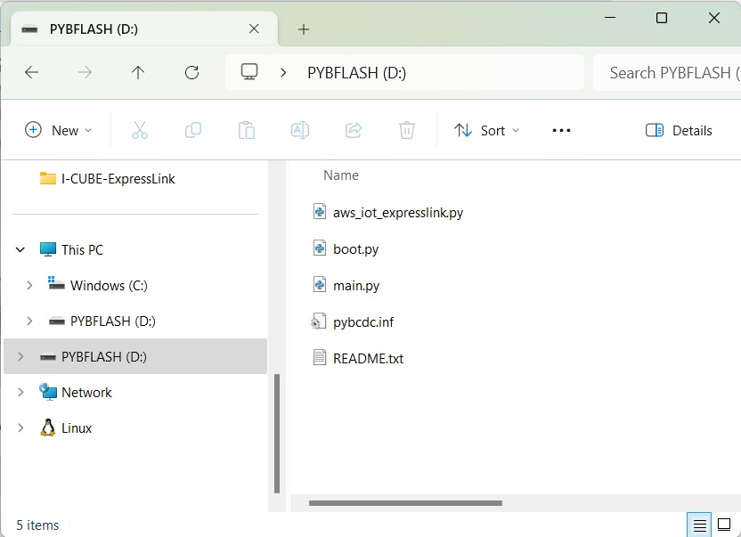
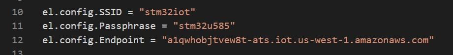

# MicroPython example.

## Note
This example was tested with <a href="https://www.st.com/en/evaluation-tools/b-l475e-iot01a.html" target="_blank">B-L475E-IOT01A</a> board 

The aws_iot_expresslink.py file was modified from the original file (comments deleted) to accomodate the STM32L475E RAM size.

## How to use
* Download the [MicroPython Firmware](https://micropython.org/resources/firmware/B_L475E_IOT01A-20231005-v1.21.0.hex) for the <a href="https://www.st.com/en/evaluation-tools/b-l475e-iot01a.html" target="_blank">B-L475E-IOT01A</a> board

* Use [STM32CubeProgrammer](https://www.st.com/stm32cubeprog) to flash the board

* Change the <a href="https://www.st.com/en/evaluation-tools/b-l475e-iot01a.html" target="_blank">B-L475E-IOT01A</a> power switch to use the USB MCU

* Install the ExpressLink module on the NUCLEO_WB55 board

* Use the USB MCU USB port instead of the ST-Link USB port as shown in the image below.

* Copy and paste the main.py to the NUCLEO_WB55 board

* Open the **main.py** from the **PYBFLAH** and Update the AWS Endpoint, Wi-Fi SSID and password

* Save **main.py** file

* Reset the board

* User a serial terminal to observe the application debug output

## PublishSensorData

The PublishSensorData.py example reads humidity and temerature from the onboard hts221 sensor and publish to AWS

Requiers the [micropython_hts221 library](https://github.com/jposada202020/MicroPython_HTS221)