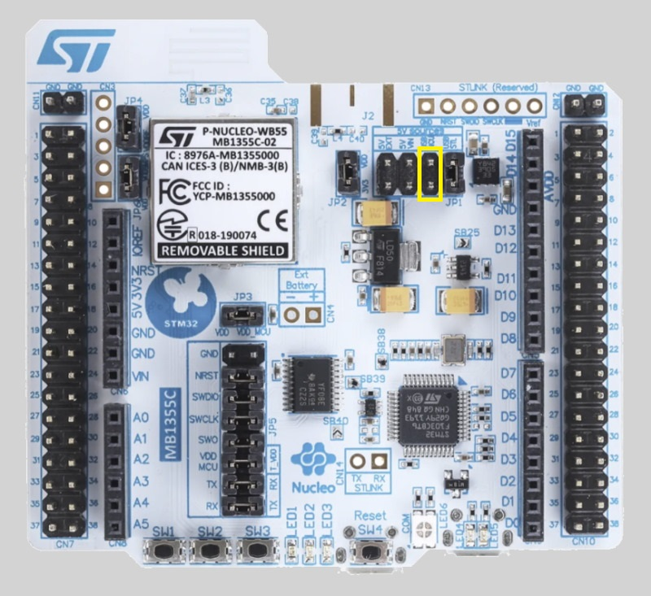
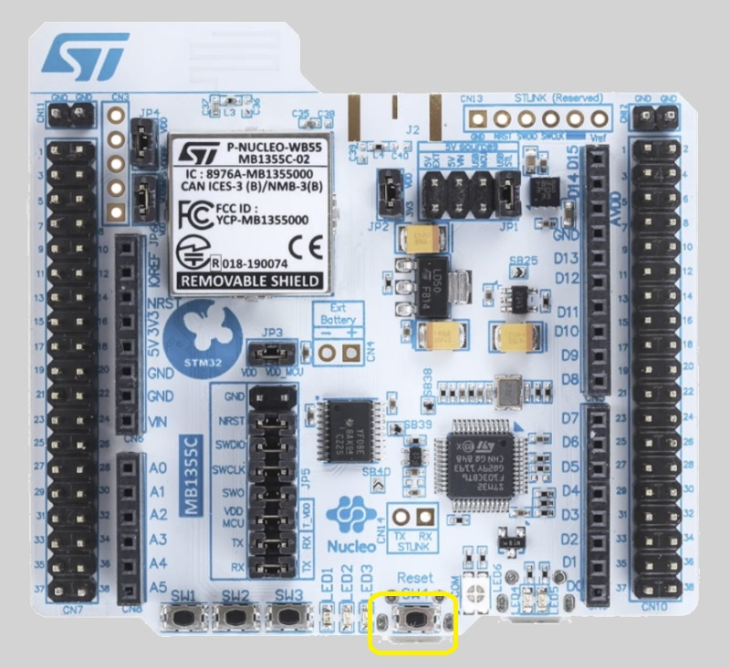
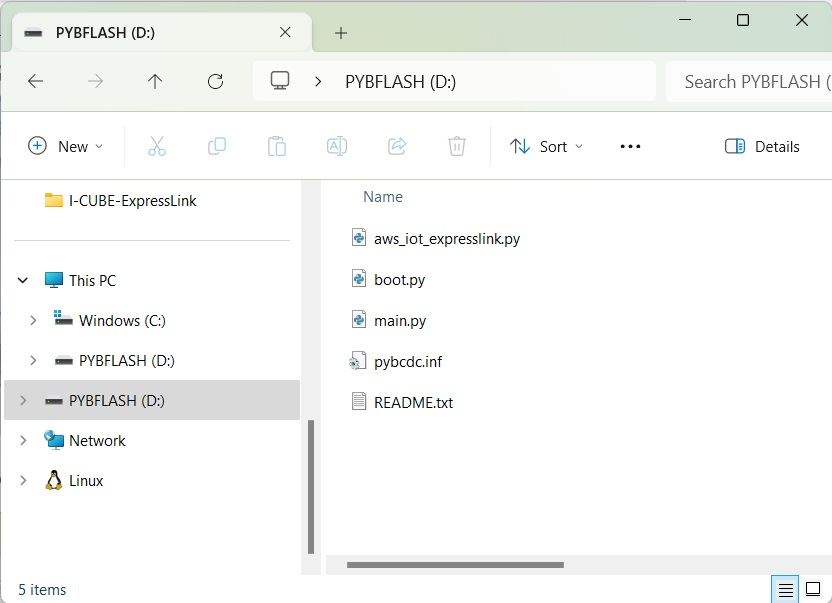
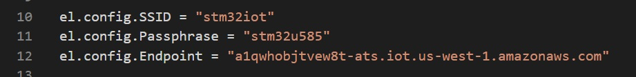
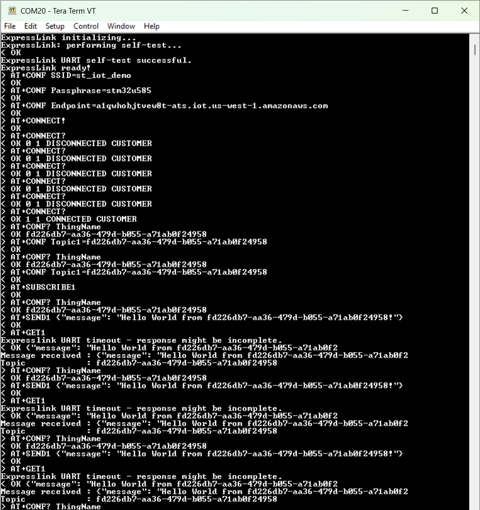
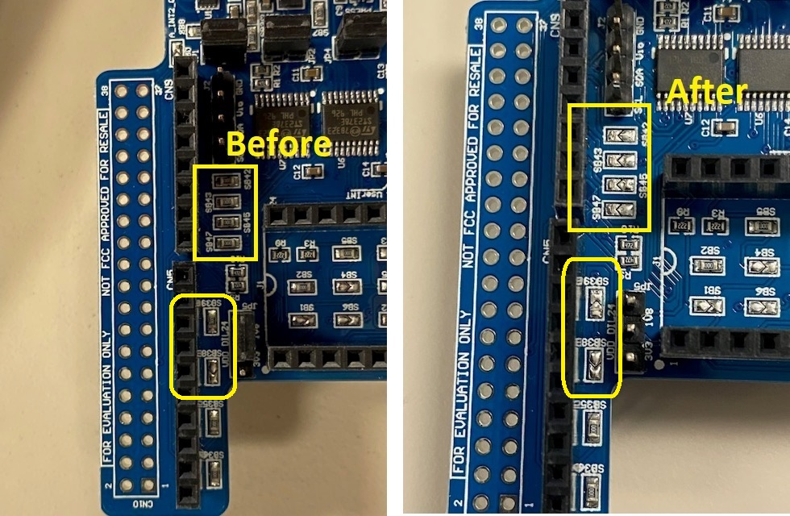

# MicroPython example.

## Note
This example was tested with [NUCLEO-WB55RG](https://www.st.com/en/evaluation-tools/p-nucleo-wb55.html) board 

## How to use
* Download the [MicroPython Firmware](https://micropython.org/resources/firmware/NUCLEO_WB55-20220618-v1.19.1.hex) for the [NUCLEO-WB55RG](https://www.st.com/en/evaluation-tools/p-nucleo-wb55.html) board

* Use [STM32CubeProgrammer](https://www.st.com/stm32cubeprog) to flash the board

* Change the [NUCLEO-WB55RG](https://www.st.com/en/evaluation-tools/p-nucleo-wb55.html) power switch to use the USB MCU

* Install the ExpressLink module on the NUCLEO_WB55 board

* Use the USB MCU USB port instead of the ST-Link USB port. The one under the reset button

* Copy and paste the main.py to the NUCLEO_WB55 board

* Open the **main.py** from the **PYBFLAH** and Update the AWS Endpoint, Wi-Fi SSID and password

* Save **main.py** file

* Reset the board

* User a serial terminal to observe the application debug output

## PublishSensorData

The PublishSensorData.py example reads humidity and temerature from the hts221 sensor mounted on the [X-NUCLEO-IKS01A3](https://www.st.com/en/ecosystems/x-nucleo-iks01a3.html) and publish to AWS

Requiers the [micropython_hts221 library](https://github.com/jposada202020/MicroPython_HTS221) and the [X-NUCLEO-IKS01A3](https://www.st.com/en/ecosystems/x-nucleo-iks01a3.html)

You need to remove the following soldering brideges from the [X-NUCLEO-IKS01A3](https://www.st.com/en/ecosystems/x-nucleo-iks01a3.html)

  * SB38, SB39, SB42, SB43, SB45 and SB47

