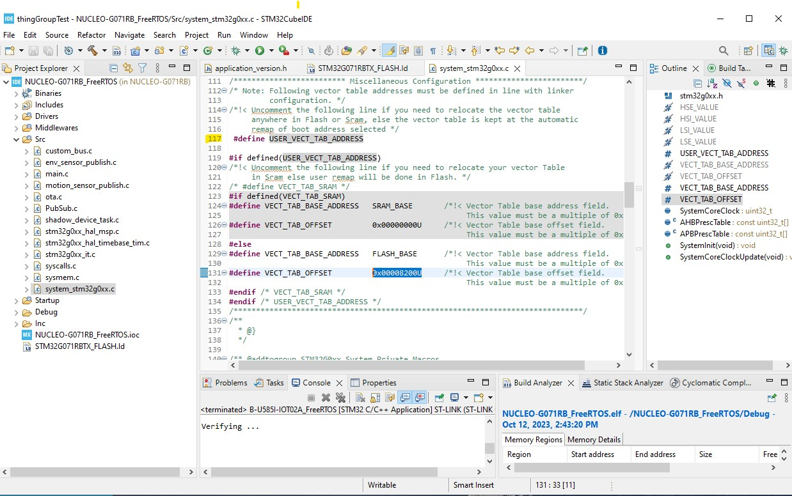
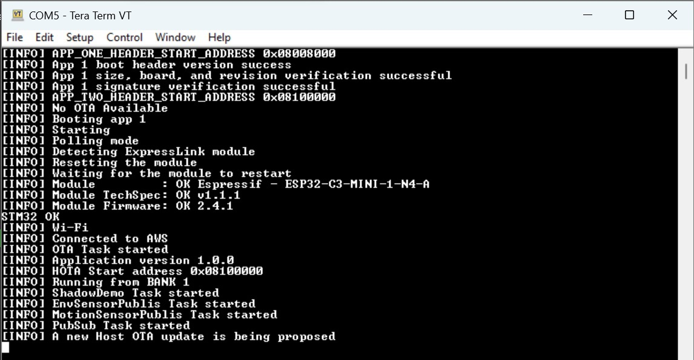
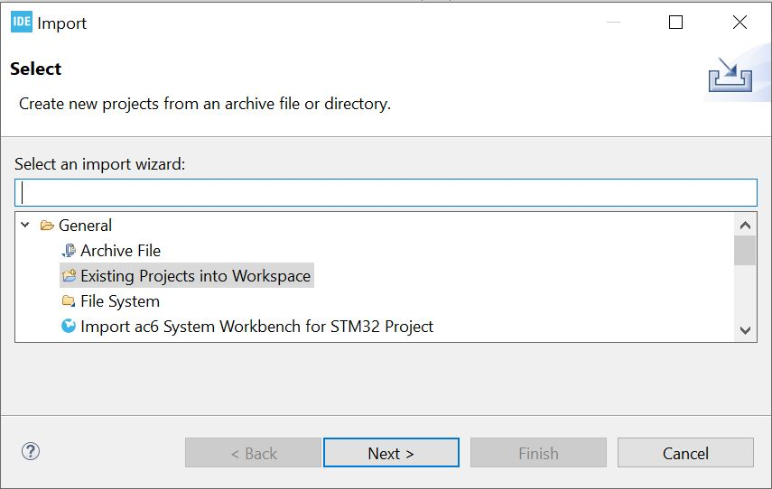
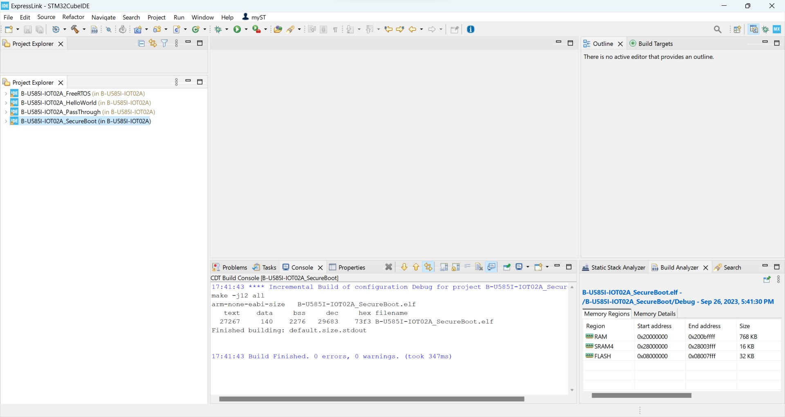

# Tiny SecureBoot for Expresslink

**Before going through this Tiny Secure Boot project, please refer to the [ExpressLink GitHub](https://github.com/stm32-hotspot/I-CUBE-ExpressLink)** and run a successful Host Over The Air (HOTA) update. 

While all the necessary steps are outlined in this document, you may find the accompanying **[Video Tutorial](https://youtu.be/r7H9otJWWCI)** helpful. 

## 1- Overview

* The Tiny Secure Boot feature enhances **security** and enables **HOTA updates for any STM32**, all while maintaining a **small footprint** and **easy adaptability** to your specific needs.
  
* Enables HOTA for all STM32s (Single and dual bank devices)

* The process is automated through **scripts**, resulting in a seamless and efficient user experience.

* Examples provided for the following boards:
    * [B-U585I-IOT02A](https://www.st.com/en/evaluation-tools/b-u585i-iot02a.html)
    * [NUCLEO-G071RB](https://www.st.com/en/evaluation-tools/nucleo-g071rb.html)
  

* **Enhances the security** of your system by **verifying the ECDSA signature** of the main application before booting it.
* Supports **all STM32 boards** (dual and single bank, with and without PKI accelerator), making HOTA updates compatible with any STM32 board.
* **Small footprint** < 32K (Down to 16K)​
* **Easy to debug/customize/use**

_NOTE: The Tiny Secure Boot is not intended as an industrial standard or production-ready security solution. Rather, it serves as an example to help you design a secure boot or secure firmware update process. To determine your security architecture, it is recommended that you work with a security expert._

## 2- Boot flow :
  * Verifies the ECDSA signature of the main application before booting into it​
  * Detects if new firmware HOTA is available​
  * HOTA installation conditions verification :
    * Revision >= current revision
    * Board name == current board name
    * Application size <= max allowable application size
  * Verifies the ECDSA signature of HOTA application
  * Installs HOTA application​

<p align="center"></p>


## 3- Memory map

Single bank and dual bank devices will have different memory map.

The memory is split between the Secure Boot, the Application, a reserved HOTA memory region and the Metadata section. 

The Metadata sections contains the Wi-Fi SSID, Wi-Fi password, APN and AWS endpoint

<p align="center"></p>


The sign.py scrip adds a header and a signature to the FreeRTOS binary project and generates a *signed_binary.bin* file. The header and signature are used by the Secure boot to verify and authenticate the Application before running it and the HOTA before installing it

<p align="center"></p>

It is important to know the maximum Application binary size and maximum HOTA binary size "*MAX_HOTA_SIZE*"

The MAX HOTA size = MAX App size = *MAX_HOTA_SIZE*.

To calculate the *MAX_HOTA_SIZE*:

* Dual bank device : MAX_HOTA_SIZE = ((FLASH_SIZE/2) - SECURE_BOOT_SIZE - METADATA_SIZE) - HEADR_SIZE. 
  * Example: STM32U585AI = (2048/2) - 32K -8K -1K= 983K

* Single bank device : MAX_HOTA_SIZE = ((FLASH_SIZE - (2 * METADATA_SIZE)- SECURE_BOOT_SIZE)/2) - HEADR_SIZE. 
  * Example STM32G071RB = ((128K - (2 * 2k) - 32K)/2) -1K= 45K

* METADATA_SIZE = FLASH_PAGE_SIZE

## 4- Scripts

* **/scripts/sign/sign.ps1**: Signs a FreeRTOS project binary.
* **/flash_binary.ps1**: Uses [STM32CubeProgrammer](https://www.st.com/en/development-tools/stm32cubeprog.html) to flash the FreeRTOS application and the Secure Bootloader to the correct memory addresses. 
* **/scripts/host-ota/hota_update.ps1**:  Uses python to issue an AWS OTA job for any STM32 board.
* **/scripts/host-ota-cert/generate_cert.ps1** : Generates a self-signed X-509 certificate associated to a key pair and uploads it to [AWS ACM](https://aws.amazon.com/certificate-manager/?trk=0d873978-11ec-4d4f-9e53-b563bf029726&sc_channel=ps&ef_id=EAIaIQobChMI4v3N6pLKgQMVWBqtBh1NpQPUEAAYASAAEgKqRvD_BwE:G:s&s_kwcid=AL!4422!3!658520966333!!!g!!!19852661921!149878721700) to be used for HOTA.
* **/scripts/host-ota-cert/set_hota_cert.ps1** : Sets the self-signed X-509 certificate inside the ExpressLink to be used for HOTA.

## 5- FreeRTOS project Setup

The B-U585I-IOT02A board is used as an example. The steps for the NUCLEO-G071RB are the same

### 5.1 Enable SECURE_BOOT option

* Copy the following path and paste it into the Windows search bar :
```
%HOMEPATH%\STM32Cube\Repository\Packs\STMicroelectronics\I-CUBE-ExpressLink\1.0.0\Projects\FreeRTOS
```
* Select your board folder and double click on **Your-Board-Name_FreeRTOS.ioc** to open it with STM32CubeMX.

* In the Middleware and Software Packs section, select **I-CUBE-ExpressLink**

* Select the **User Constants** tab

* Double click on the **SECURE_BOOT** parameter and set its value to **1**

<p align="center"></p>

* Click **Generate code** to create your project
* Click **Open** the project. The project should open in STM32CubeIDE. 

### 5.2 Edit the linker file

* In STM32CubeIDE, open the **STM32U585AIIXQ_FLASH.ld** file and change the Flash ORIGIN to **0x08008200** and Flash LENGTH to 983K (= MAX_HOTA_SIZE) (45k for the case of NUCLEO-G071RB)

<p align="center"></p>

### 5.3 Set the vector table offset

* Open the **system_stm32u5xx.c** file and change the vector table offset to 0x00008200

<p align="center"></p>

**NOTE**: For ***NUCLEO-G071RB*** line **#117** must be uncommented as pictured below

<p align="center"></p>

### 5.4 Generate bin file

* Build the FreeRTOS project

<p align="center"></p>


## 6- Run the FreeRTOS and Tiny Secure Boot

### 6.1 Sign the FreeRTOS binary
*Now we are going to sign this FreeRTOS app using our scripts.* \
*We are providing three solutions with different security and complexity levels :* 
  - ***Local : Use locally stored key** - default and simplest process, but less secure.* \
     *Default keys stored locally and prebuilt Secure boot (see **current section**). \
     Can generate new keys but will need to rebuild the Secure Boot project (see **section 8**) \
     Binary signature done locally* 


  - ***KMS : Use AWS key** - more steps but more secure* \
     *Keys generated and stored on AWS Key Management Service\
     Need to rebuild the Secure Boot project (see **section 8**)\
     Binary signature done inside AWS \
     May incur extra costs \
     **Refer to the following KMS [README.md](../scripts/sign/KMS/README.md)***


  - ***TinyHSM : Use STSafe keys** - most steps but most secure* \
     *Keys generated and stored on STSafe \
     Need to rebuild the Secure Boot project (see **section 8**) \
     Binary signature done inside STSafe \
     [B-U585I-IOT02A](https://www.st.com/en/evaluation-tools/b-u585i-iot02a.html) board needed \
     **Refer to the following TinyHSM [README.md](../scripts/sign/TinyHSM/README.md)***


#### **Local Signing Process : Use locally stored key**

* Copy the following path, then paste it into the search bar and click enter.
```
%HOMEPATH%\STM32Cube\Repository\Packs\STMicroelectronics\I-CUBE-ExpressLink\1.0.0\Projects\scripts\sign
```

* Open the file **sign.ps1** with any text editor. Then **uncoment the name of your board** and save your file.

<p align="center"></p>

* Still from the sign folder, open a powershell window and run the following command :
```
.\sign.ps1
```

*You will see the output of the ECDSA signature of the app : the key used and the resulted signature.*

<p align="center"></p>

### 6.2 Flash the binary

*Now we are going to flash the signed FreeRTOS app and the SecureBoot into our board using our script.*

* Copy the following path, then paste it into the search bar and click enter.
```
%HOMEPATH%\STM32Cube\Repository\Packs\STMicroelectronics\I-CUBE-ExpressLink\1.0.0\Projects\SecureBoot
```

* Open the file **flash_binary.ps1** with any text editor. Then **uncomment the name of your board** and save your file.

<p align="center"></p>

* Still from the SecureBoot folder, double click on the **flash_binary.ps1** to run it. You can alternatively open a powershell window and run the following command :
```
.\flash_binary.ps1
```

<p align="center"></p>

* Open a serial emulator like this [online serial emulator](https://googlechromelabs.github.io/serial-terminal/) (or Tera Term)
   * Click "Connect", select the ST-Link COM port, and click "Connect"
   * Choose the following settings : 
     * Baud rate : 115200
     * Data bits : 8-bits
     * parity : None
     * Check Local Echo box 

**From there you will be able to see the board connected to AWS and printing your application revision number :**

<p align="center"></p>

*B-U585I-IOT02A board example with Debug info printed*

## 7- Issue a HOTA
### 7.1 Generate new FreeRTOS binary

* In STM32CubeIDE, proceed with the **FW changes** you want of the FreeRTOS project for your new update, and **update the app version number** in the file **Inc\application_version.h**.

* It is important that you **increase the revision number** in the **Inc\application_version.h** file. The Secure Boot **will not install** new HOTA firmware if the revision number is less than or equal to(=<) current firmware revision number

*  **Build** your new FreeRTOS project.

### 7.2 Sign new FreeRTOS binary

*Now we need to **sign** our new firmware like previously.* \
*You will need to use the **same signing process** you chose in **section 6.1***. \
*If you didn't chose the **Local** signing process, please refer to the corresponding file for this step :* \
***KMS :*** [README.md](../scripts/sign/KMS/README.md) \
***TinyHSM :*** [README.md](../scripts/sign/TinyHSM/README.md)

#### **Local Signing Process : Use locally stored key**

To do so copy the following path, then paste it into the search bar and click enter.
```
%HOMEPATH%\STM32Cube\Repository\Packs\STMicroelectronics\I-CUBE-ExpressLink\1.0.0\Projects\scripts\sign
```
* Make sure the script **sign.ps1** still has your **board name** uncommented like done previously.
*  Open a powershell window and run the following command :
```
.\sign.ps1
```

### 7.3 Issue a HOTA

* To access the **HOTA script folder**, copy the following path, then paste it into the search bar and click enter :
```
%HOMEPATH%\STM32Cube\Repository\Packs\STMicroelectronics\I-CUBE-ExpressLink\1.0.0\Projects\scripts\host-ota
```
* Open the script file **hota_update.ps1** with a text editor.
* You can keep all the settings as you have them when you initiated a non Secure HOTA (refer to [ExpressLink GitHub](https://github.com/stm32-hotspot/I-CUBE-ExpressLink) if needed).\
  
The only change needed is to uncomment the line: 
```
$BIN_FILE='signed_binary.bin'
```
and to comment out the previously used line:

```
#$BIN_FILE=$BOARD+'_FreeRTOS.bin.
```

<p align="center"></p>
   
* Still from the hota-script folder, open a Command Prompt Terminal and paste the following command to **run the script that will issue your HOTA** :

```
.\hota_update.ps1
```

<p align="center"></p>

* Open a serial emulator like this [online serial emulator](https://googlechromelabs.github.io/serial-terminal/) (or Tera Term)
   * Click "Connect", select the ST-Link COM port, and click "Connect"
   * Choose the following settings : 
   * Baud rate : 115200
   * Data bits : 8-bits
   * parity : None
   * Check Local Echo box 

**You should then see the execution of the following steps :**
- Verify the main app signature and header with Secure Boot
- Boot the main app
- Detect the HOTA
- Verify the HOTA's AWS certificate signature
- Download the HOTA into the reserved HOTA memory region
- Verify the HOTA signature and header with Secure Boot
- Copy the HOTA in place of the previous main application
- Reset the board
- Verify the header and signature of the HOTA with Secure Boot, which is now the main app
- Boot the new main app

_NOTES : \
-For the G0 example, in order to keep the Boot Loader size lower than 32K, no debug information are printed from the secure bootloader._\
-Some steps might take some time before printing outputs.

**By checking the printed version number after the reset of the board, you can ensure that the HOTA was successful.**

<p align="center"></p>

*B-U585I-IOT02A board example with Debug info printed*

## 8- Rebuild the Secure Boot project

By default, the Secure boot comes prebuilt and uses the public key present in the scripts\sign directory. If you want to use different key, then you need to generate new keys and rebuild the secure boot project.

### 8.1 Generate new keys

To generate a new file private_key.pem, run the script **gen_keys.ps1** by double clicking on it. You can alternatively open a powershell window and run the following command :

```
.\gen_keys.ps1
```

### 8.2 Generate a new SigGen.c file

* Open the file **sign.ps1** with any text editor. Then **uncomment the name of your board** and save.

<p align="center"></p>

* Still from the sign folder, open a powershell window and run the following command :
```
.\sign.ps1
```

*You will see the output of the ECDSA signature of the app : the key used and the resulted signature*

<p align="center"></p>

In addition to the **signed_binary.bin** file, the script generates a **SigGen.c** file that contains the public key and saves it to the following directory.

```
%HOMEPATH%\STM32Cube\Repository\Packs\STMicroelectronics\I-CUBE-ExpressLink\1.0.0\Projects\SecureBoot\ < Your-board > \Src
```


<p align="center"></p>

### 8.3 Import the ST Crypto library *(for Non-PKA devices only)*
_NOTE : This step is Required for NUCLEO-G071RB project and **not** required for B-U585I-IOT02A project._

  * Please refer to the datasheet of your board's microcontroller to determine if it comes with a Public Key Infrastructure Accelerator ("PKA" or "PKI accelerator").\
  If you are using a microcontroller that doesn't contain a PKI accelerator, you will need to install the ST cryptographic library.

  * Download the library at this link : [ST cryptographic library](https://www.st.com/en/embedded-software/x-cube-cryptolib.html#st_all-features_sec-nav-tab)
  * In the downloaded library go to the location **STM32CubeExpansion_Crypto_V4.1.0\Middlewares\ST** \
   and copy the folder **STM32_Cryptographic**
  * Paste the folder at the following location :
  ```
  C:\Users\SecureBoot\SecureBoot\YOUR-BOARD-NAME\Middlewares\ST
  ```
<p align="center"></p>

### 8.4 Build Secure boot project

* In STM32CubeIDE, go to **File > Import** and in the opening window choose **General > Import existing Projects into workspace** :

<p align="center"></p>

* Click **Browse** and **paste** the following path into the path folder tab on the top of the opening window to access the SecureBoot folder. Choose **Select folder**.
```
%HOMEPATH%\STM32Cube\Repository\Packs\STMicroelectronics\I-CUBE-ExpressLink\1.0.0\Projects\SecureBoot
```
* Select the project of your **board name** and click **Finish**.

<p align="center"></p>

* Build the Secure Boot project

<p align="center"></p>


**You can now jump to section [6- Run the FreeRTOS and Tiny Secure Boot](#6--run-the-freertos-and-tiny-secure-boot)**


  ota/hota_update.py Projects/scripts/sign/Local/sign.py Projects/scripts/sign/TinyHSM/config_TinyHSM.ps1 Projects/scripts/sign/TinyHSM/config_TinyHSM.py Projects/scripts/sign/TinyHSM/sign.ps1 Projects/scripts/sign/TinyHSM/sign.py Projects/scripts/utils/TinyHSM.py
