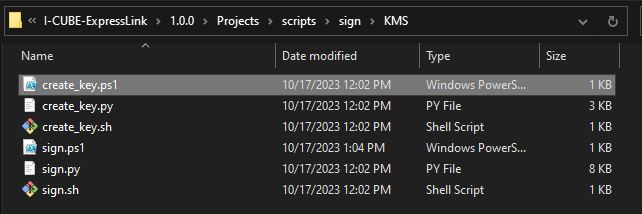
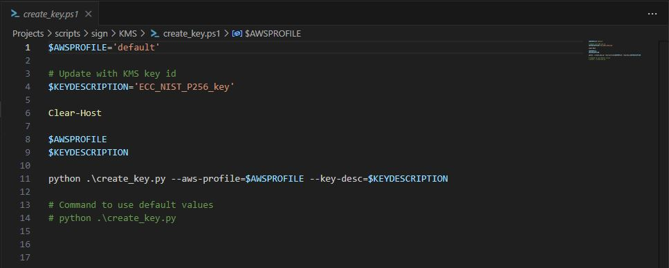
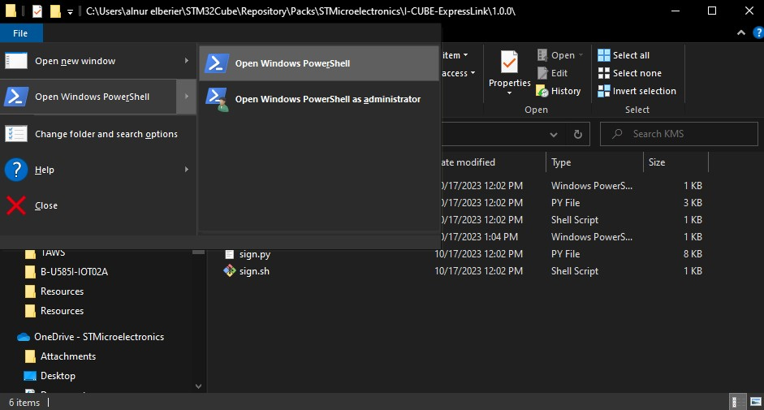
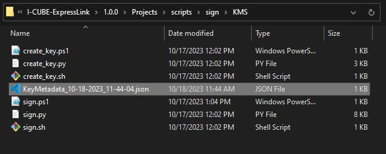
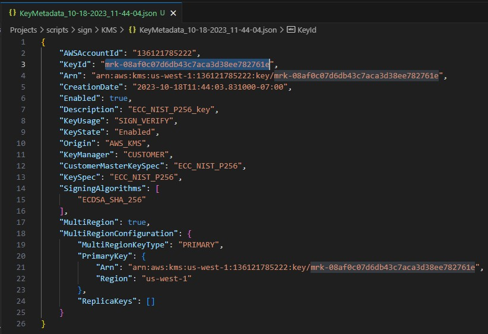
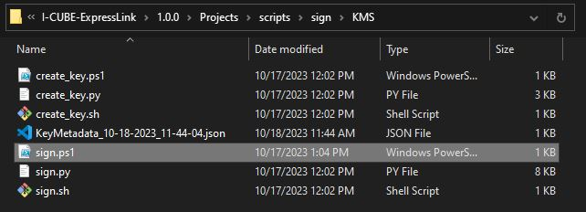
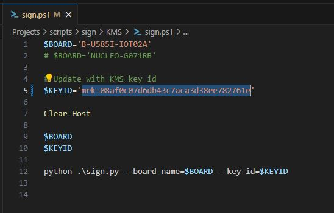
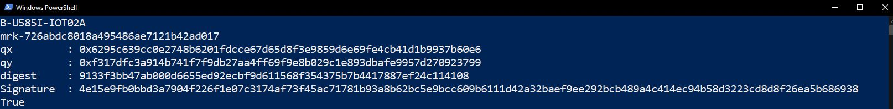
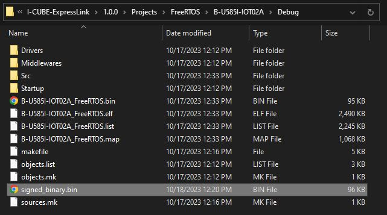

# Signing Secure Boot Firmware with AWS Key Management Service (KMS)

This document provides instructions on how to use the KMS firmware signing scripts to sign a secure boot firmware image.

## Prerequisites

Before you can use the scripts, you need to have the following:

- AWS CLI installed on your machine
- AWS CLI user profiles configured on your machine
- User access to AWS KMS
- The SECURE_BOOT STM32CubeMX user constant set to 1 for your FreeRTOS application
- A FreeRTOS application built with STM32CubeIDE

## What is AWS KMS?

AWS Key Management Service (KMS) is a managed service that makes it easy for you to create and control the encryption keys used to encrypt/sign your data. With AWS KMS, you can create keys that are used to encrypt and decrypt data, and you can also use the service to manage the lifecycle of your keys.

## Benefits of Using AWS KMS

Using AWS KMS for key management has several benefits over storing keys locally on your developer PC:

- **Security:** AWS KMS uses hardware security modules (HSMs) to protect your keys, making it much more difficult for attackers to steal them.
- **Scalability:** AWS KMS can handle large numbers of keys, making it easy to manage key rotation and other key lifecycle events.
- **Compliance:** AWS KMS is designed to meet a number of compliance requirements, including HIPAA, PCI DSS, and SOC 2.
- **Ease of use:** AWS KMS integrates with a number of AWS services, making it easy to use your keys for encryption and decryption.

## Disclaimer

- Please note that we are not AWS security experts, and this solution should be evaluated by a security expert before being used in an industrial environment. 
- Please note that using AWS KMS may incur some costs, depending on your usage.

## Creating a Key

To create a key, follow these steps:

1. Open a the KMS directory in file explorer
    ```
    %HOMEPATH%\STM32Cube\Repository\Packs\STMicroelectronics\I-CUBE-ExpressLink\1.0.0\Projects\scripts\sign\KMS\
    ``` 
2. Open `create_key.ps1` in a text editor.
   
   <p align="center"></p>

3. If the default values for `AWSPROFILE` and `KEYDESCRIPTION` are not suitable, you can set these environment variables to your desired values.
    <p align="center"></p>

4. Open a powershell window in the KMS directory
   <p align="center"></p>

5. Run the `create_key.ps1` script using the following command:

   ```
   ./create_key.ps1
   ```

   This script generates a key in AWS KMS and saves the metadata for that key in a JSON file named `Key_Metadata_MM-DD-YYYY_HR-MN-SEC.json`.

   <p align="center"></p>

   

## Signing the Firmware

To sign the firmware, follow these steps:

1. Open the `Key_Metadata_MM-DD-YYYY_HR-MN-SEC.json` file in a text editor and copy the `KeyId` value.
   
   <p align="center"></p>

2. From the KMS directory, open `sign.ps1` in a text editor.
   
   <p align="center"></p>

3. Uncomment the `BOARD` name that you are using, and replace the `KEYID` with the one copied from the json file file above.
   
   <p align="center"></p>

4. Open a powershell window in the KMS directory
   
   <p align="center"></p>

5. Run the `sign.ps1` script using the following command:

   ```
   ./sign.ps1
   ```

   This script uses the AWS KMS key to sign the firmware image and prints the following output:
    - Board Name 
    - Key ID
    - Signature qx and qy coordinates
    - Hashed digest of the original firmware
    - Signature
    - True / False if signature is verified successfully

   <p align="center"></p>

Congratulations! You have successfully signed the firmware image using the KMS scripts. The signed binary now exists in the following directory:

```
%HOMEPATH%\STM32Cube\Repository\Packs\STMicroelectronics\I-CUBE-ExpressLink\1.0.0\Projects\FreeRTOS\{BOARD}\Debug\signed_binary.bin
``` 

<p align="center"></p>

## Conclusion

In this document, you learned how to use the firmware signing scripts to sign a firmware image using AWS KMS. Using AWS KMS for key management provides several benefits over storing keys locally on your developer PC, including increased security, scalability, compliance, and ease of use. However, please note that we are not AWS security experts, and this solution should be evaluated by a security expert before being used in an industrial environment. Additionally, please note that using AWS KMS may incur some costs, depending on your usage.
