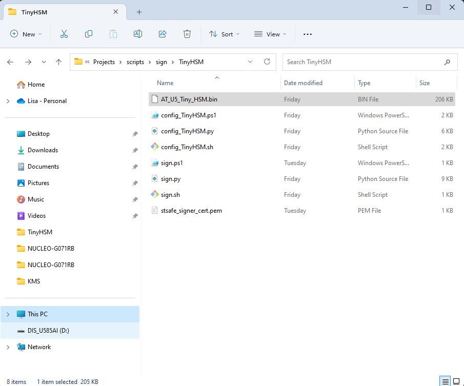
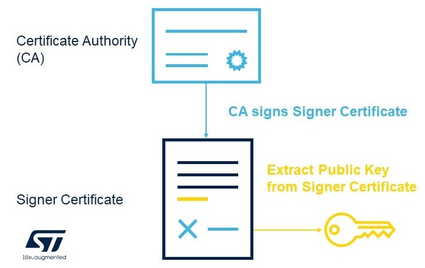
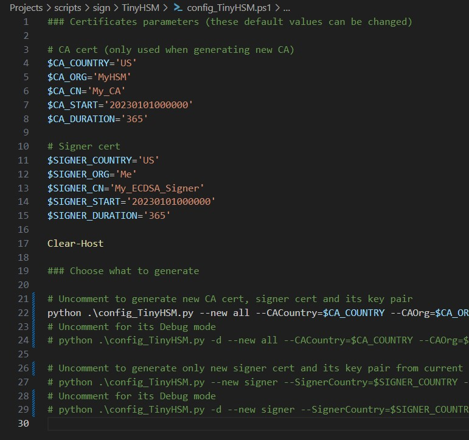
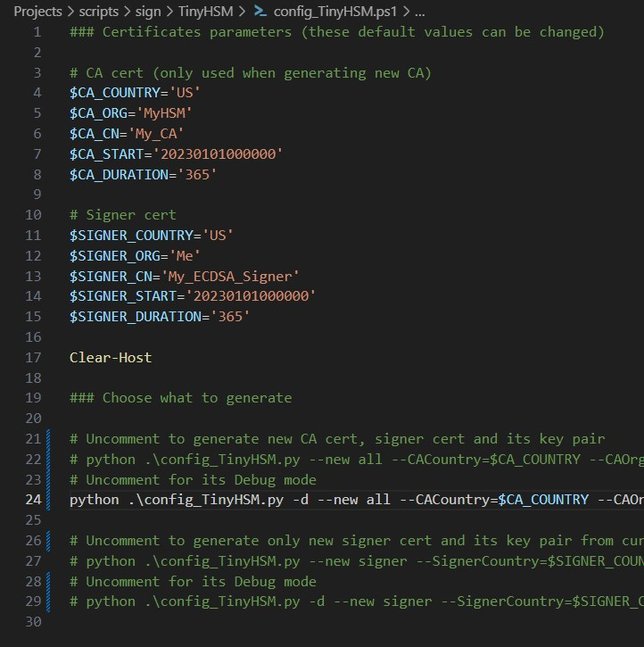
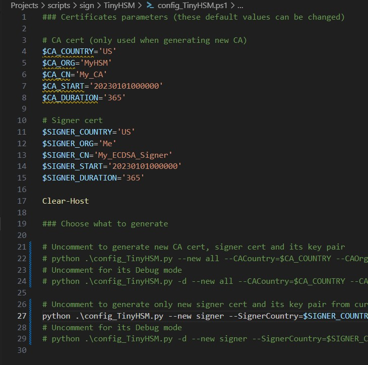
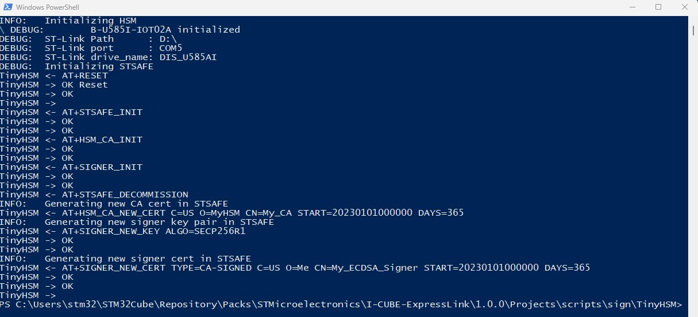
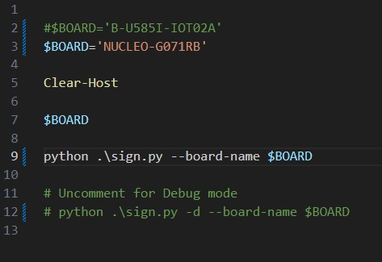
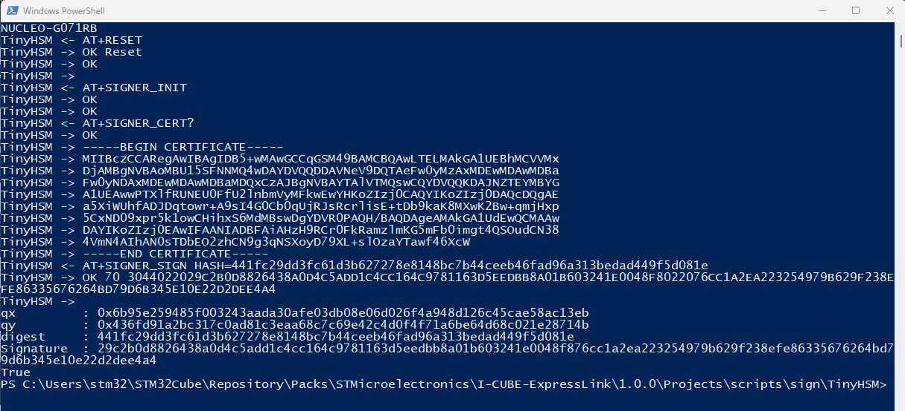

# Tiny HSM for Secure Boot

In this section, we are going to explore the Tiny HSM alternative to the use of the local keys for the FreeRTOS+Secure Boot project.

## What is Tiny HSM ?
 
Hardware Security Module (HSM) are hardware units storing in a protected way cryptographic keys while allowing authorized users to use them.\
In particular, HSMs offer operations involving the private keys it contains without ever providing users access to it. \
Therefore this solution improves the safety of your system by reducing your attack surface, without compromising usage possibilities \
A common use is to have key pair(s) created, managed and safely stored in an HSM, and to have the HSM signs data internally using these keys pairs without revealing the private keys used.


For you to get familiar with the concept and advantages of an HSM, ST provided a Tiny HSM project that acts like an HSM device using the [STSafe](https://www.st.com/en/secure-mcus/stsafe-a110.html) component of a [B-U585I-IOT02A](https://www.st.com/en/evaluation-tools/b-u585i-iot02a.html) board, resulting in a safer binary signing process and key storage protection.\
It will be used to sign the FreeRTOS project binaries intended for direct flashing and HOTAs.
 
## Disclaimer
 
This project is for your understanding of HSM and demos only and should not be used for distribution.

For commercial purposes, you can use commercial grade HSMs : 
- HSM Physical Devices : a unit you purchase and for which you manage its physical location, deployment and life cycle.
- Cloud-based HSMs : a unit kept in a cloud data center for which you can rent full usage from the cloud provider or pay to access its functionalities as needed. 

Please note that we are not HSM security experts, and HSMs solutions should be evaluated by a security expert before being used in an industrial environment.

## Folder content


* You can find the Tiny HSM folder at the following path (paste into your Windows search bar to open):

```
%HOMEPATH%\STM32Cube\Repository\Packs\STMicroelectronics\I-CUBE-ExpressLink\1.0.0\Projects\scripts\sign\TinyHSM
```

* **AT_U5_Tiny_HSM.bin** :\
    ST provides the pre-built TinyHSM binary image directly

* **config_TinyHSM** :
    python script (and associated ps1/sh files) that:
    - create and store a CA (Certificate Authority)\
    - create and store an ECDSA signer certificate and its key pairs (authenticated by the CA)

* **sign** :
    python script (and associated ps1/sh files) that:
    - sign a binary using the keys stored in the HSM/STSafe

## Prerequisites
 
Before you can use the scripts, you need to have the following:
 
- Access to a [B-U585I-IOT02A](https://www.st.com/en/evaluation-tools/b-u585i-iot02a.html) board to run TinyHSM
- A FreeRTOS firmware binary image built (See section **5- FreeRTOS project Setup** of the [Secure Boot Readme](../../../SecureBoot/README.md))

Flash the Tiny HSM binary:

* Unplug your Express Link board and connect a [B-U585I-IOT02A](https://www.st.com/en/evaluation-tools/b-u585i-iot02a.html) board to your PC.

* Paste the following path into your Windows search bar to access the TinyHSM binary file **AT_U5_Tiny_HSM.bin**:

```
%HOMEPATH%\STM32Cube\Repository\Packs\STMicroelectronics\I-CUBE-ExpressLink\1.0.0\Projects\scripts\sign\TinyHSM
```
* Drag and drop the binary file into the USB Drive  **DIS_U585AI**


<p align="center"></p>

*Note :*\
*If you are getting trouble with this method you can alternatively use STM32CubeProgramer to download the binary at the start address 0x08000000.*


## Creating a Key

*NOTE : This step is **required only the first time the Tiny HSM is being flashed into your board** to provision it with the needed certificates.\
If you have already done this step before and have not erased your board since, you can jump to the next section.* 
 
To enhance the security of this process, TinyHSM uses a two level process :

<p align="center"></p>

We are first creating a certificate authority (CA).\
We then create a signer certificate that is signed (authenticated) by this CA.
Our signing key is extracted from this signer certificate.\
All the above are generated and stored in STSafe.


* Paste the following path into your Windows search bar to access the TinyHSM folder :

```
%HOMEPATH%\STM32Cube\Repository\Packs\STMicroelectronics\I-CUBE-ExpressLink\1.0.0\Projects\scripts\sign\TinyHSM
```

* Open in edit mode the file **config_TinyHSM.ps1** or **config_TinyHSM.sh** depending on which you plan to use.

*  *(Optional)* Edit the certificate parameters to what you wish.


* The first time you are running this TinyHSM project, you need to create a CA and a signer certificate before being able to sign your binary.\
To do so, uncomment the 1st command only:

<p align="center"></p>

*NOTE: You have the possibility to run it in debug mode if you wish to see the serial data being exchanged during the process:*

<p align="center"></p>

* Even if not recommended, if you already had generated a signer certificate but want to use a new one, you can generate a new one from your current CA.
To do so, you need to uncomment the 2st command only:

<p align="center"></p>

*NOTE: You also have a debug mode possibility for this command.*

***WARNING :** Once the TinyHSM has been provided with one CA, you should not generate a new CA.* 

* Open a terminal window from the TinyHSM folder

* Run **config_TinyHSM.sh** script using the following command:
   ```
   $ ./config_TinyHSM.sh
   ```
   or the the **config_TinyHSM.ps1** if using powershell :
    ```
    .\config_TinyHSM.ps1
    ```
<p align="center"></p>

*Example with the 1st command in debug mode*

## Signing the Firmware
 
To sign the firmware using the signer key located in the STSafe of the [B-U585I-IOT02A](https://www.st.com/en/evaluation-tools/b-u585i-iot02a.html) board, follow these steps:


* Paste the following path into your Windows search bar to access the TinyHSM folder :

```
%HOMEPATH%\STM32Cube\Repository\Packs\STMicroelectronics\I-CUBE-ExpressLink\1.0.0\Projects\scripts\sign\TinyHSM
```

* Open in edit mode the file **sign.ps1** or **sign.sh** depending on which you plan to use.

*  Uncomment the name of the board you are using your FreeRTOS project with.

*NOTE: You have the possibility to run it in debug mode if you wish to see the serial data being exchanged during the process. To do so uncomment the debug command line only :*

<p align="center"></p>


* Open a terminal window from the TinyHSM folder

* Run **sign.sh** script using the following command:
   ```
   $ ./sign.sh
   ```
   or the the **sign.ps1** if using powershell :
    ```
    .\sign.ps1
    ```

    <p align="center"></p>
    *Example with FreeRTOS binary for a NUCLEO-G071RB in debug mode*

 
   This script signs the binary directly inside the STSafe using the STSafe signer key previously generated, the same way an HSM would do.\
   It saves the signed binary in a new file named `signed_binary.bin` and also saves the signer certificate containing the public key in a new file `stsafe_signer_cert.pem` in the TinyHSM folder.

* Disconnect the [B-U585I-IOT02A](https://www.st.com/en/evaluation-tools/b-u585i-iot02a.html) board and reconnect your ExpressLink board.

Congratulations! You have successfully signed the firmware image using the scripts.

## Next steps to follow


If your were signing the FreeRTOS binary to flash it with the SecureBoot directly into your Expresslink board, please remember to follow the section **8- Rebuild the Secure Boot project** of the [Secure Boot Readme](../../../SecureBoot/README.md) before going back to section **6.2 Flash the binary**. \
This also applies if you changed the signer certificate being used by generating a new one.

If you were signing the FreeRTOS binary to issue an HOTA, you can go back to section **7.3 Issue an HOTA**  of the [Secure Boot Readme](../../../SecureBoot/README.md).

 
## Conclusion
 
In this document, you learned how to use the firmware signing scripts to sign a firmware image using TinyHSM.\
Using HSMs for key management provides several benefits over storing keys locally on your developer PC, including increased security, scalability, compliance, and ease of use.\
However, please note that we are not HSMs security experts, and this solution should be evaluated by a security expert before being used in an industrial environment.\
If you have any questions or issues, please contact the script developers for assistance.
 
 

