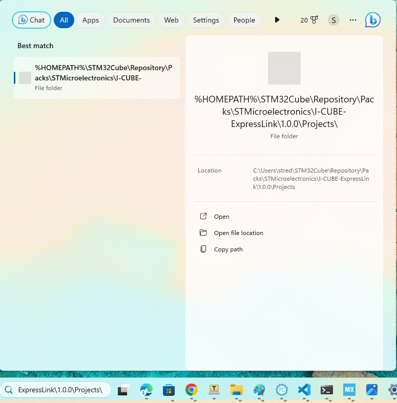
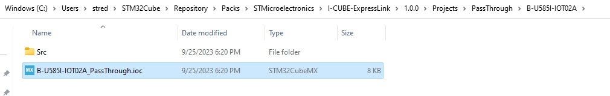
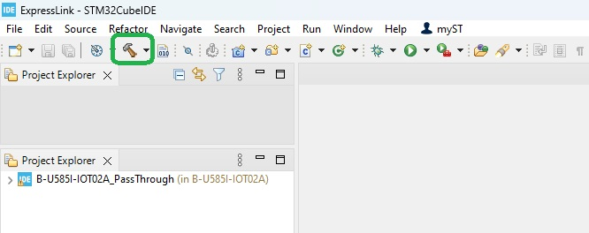
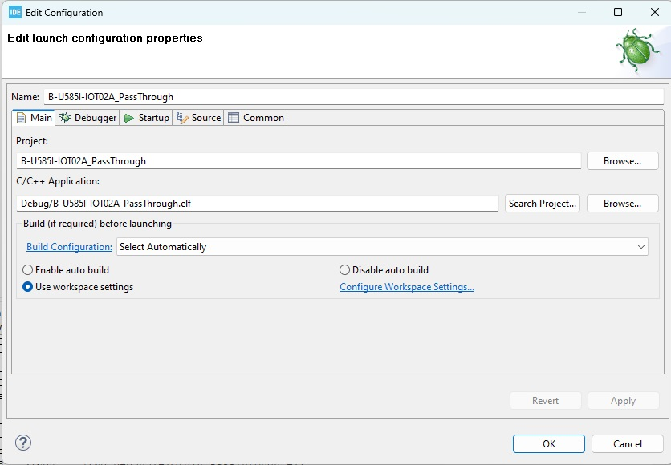
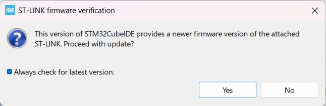
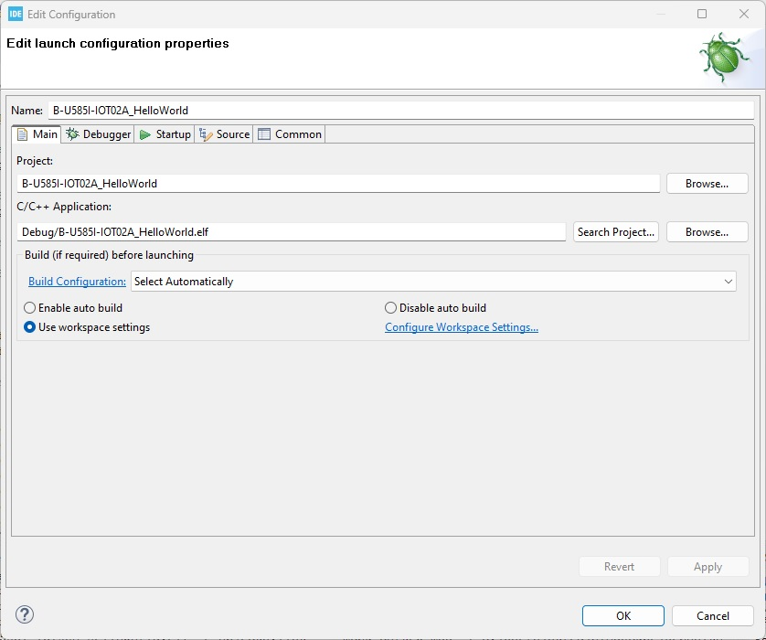

# I-CUBE-ExpressLink

## 1- Overview

*   **I-CUBE-ExpressLink** is a CMSIS pack for the <a href="https://aws.amazon.com/iot-expresslink/" target="_blank">ExpressLink</a> driver for <a href="https://www.st.com/en/microcontrollers-microprocessors/stm32-32-bit-arm-cortex-mcus.html" target="_blank">STM32</a> devices. It allows you to create applications that **connects to AWS IoT Core** using <a href="https://devices.amazonaws.com/search?page=1&sv=iotxplnk" target="_blank">ExpressLink modules</a> and to issue **Host Over-The-Air Updates**, in addition of **many other projects**.

*   **Connecting your board to AWS : Quick Connect**\
    Registers your board to AWS cloud service IoT Core automatically, and opens a serverless Dashboard that plots real time sensor data and controls LED using shadow messages.

*   **Issue Host Over the Air updates (HOTA)**\
    AWS provides the option to deploy Host OTA firmware updates on previously connected devices in your fleet. The Host OTA process uses the **ExpressLink Module** as an intermediary to update the connected board, or "**host**". This approach optimizes the host's performance by allowing for larger payload transmission, as well as optimized memory resource utilization. Additionally, the heavy authenticity checks are transferred to the Express Link Module. The package comes with scripts that simplify the Host OTA process, reducing the number of steps required and eliminating the need for familiarity with the AWS console.

* The driver is compatible with <a href="https://aws.amazon.com/about-aws/whats-new/2022/11/aws-iot-expresslink-technical-specification-v1-1-released/" target="_blank">AWS IoT ExpressLink Technical Specification v1.1</a> or higher.

* You will need to connect your board to a Wi-Fi that is at least 2.4 GHz.

* The pack was tested with the following ExpresssLink Modules:
  * <a href="https://devices.amazonaws.com/detail/a3G0h00000E2JnNEAV/ESP32-C3-AWS-IoT-ExpressLink-Module" target="_blank">ESP32-C3</a> (Wi-Fi)
  * <a href="https://github.com/telit/bravo-aws-expresslink/blob/main/get-started-guide-bravo-aws.md" target="_blank">Bravo-LE910C1-WWXDk</a> (Cellular)


## 2- I-CUBE-ExpressLink Features

* Very low code size
* Compatible with all STM32 product family
* No code/low code examples -> easy to port to any STM32 microcontroller
* Multiple examples (FreeRTOS, HelloWorld, PubSub, Shadow, PassThrough, Arduino and MicroPython)
* STM32CubeMX code configuration and project generation
* Projects for 16 boards and 12 STM32 uC series
* Same firmware/binary works with Cellular or Wi-Fi
* Multiple helper scripts (HOTA, HOTA Cert, Sign, QuickConnect)
* Tiny Secure Boot allowing secure boot and secure firmware update for all STM32s with multiple firmware signing options
* Windows, MAC and Linux support

### Projects Descriptions

### **Arduino:**
* Examples using Arduino library
   * Examples provided for <a href="https://www.st.com/en/evaluation-tools/b-u585i-iot02a.html" target="_blank">B-U585I-IOT02A</a>, <a href="https://www.st.com/en/evaluation-tools/b-l475e-iot01a.html" target="_blank">B-L475E-IOT01A</a> and <a href="https://www.st.com/en/evaluation-tools/nucleo-g071rb.html" target="_blank">NUCLEO-G071RB</a>
   * Use library from <a href="https://github.com/awslabs/aws-iot-expresslink-library-arduino" target="_blank">aws-iot-expresslink-library-arduino</a> 
   * Get started <a href="https://github.com/stm32duino/Arduino_Core_STM32/wiki/Getting-Started" target="_blank">here</a>
### **MicroPython:**
* Examples using MicroPython
   * Examples provided for <a href="https://www.st.com/en/evaluation-tools/nucleo-wb55rg.html" target="_blank">NUCLEO-WB55RG</a> and <a href="https://www.st.com/en/evaluation-tools/b-l475e-iot01a.html" target="_blank">B-L475E-IOT01A</a>
   * Use library from <a href="https://github.com/awslabs/aws-iot-expresslink-library-python" target="_blank">aws-iot-expresslink-library-python</a> 
   * Get started [here](./Projects/MicroPython/NUCLEO-WB55RG/readme.md) for NUCLEO-WB55RG or [here](./Projects/MicroPython/B-L475E-IOT01A/readme.md) for B-L475E-IOT01A

### **Passthrough:**
* STM32 used as a UART bridge to communicate with the ExpressLink module using serial terminal and AT commands. This enables OTW updates, device ID retrieval, certificate acquisition, module testing, and [register your ExpressLink module with AWS](#7--use-passthrough-project-to-register-expresslink-module-to-your-aws-development-account)
* Examples provided for the following boards:
    * <a href="https://www.st.com/en/evaluation-tools/32f769idiscovery.html" target="_blank">32F769IDISCOVERY</a>
    * <a href="https://www.st.com/en/evaluation-tools/b-l4s5i-iot01a.html" target="_blank">B-L4S5I-IOT01A</a>
    * <a href="https://www.st.com/en/evaluation-tools/b-l475e-iot01a.html" target="_blank">B-L475E-IOT01A</a>
    * <a href="https://www.st.com/en/evaluation-tools/b-u585i-iot02a.html" target="_blank">B-U585I-IOT02A</a>
    * <a href="https://www.st.com/en/evaluation-tools/nucleo-c031c6.html" target="_blank">NUCLEO-C031C6</a>
    * <a href="https://www.st.com/en/evaluation-tools/nucleo-f722ze.html" target="_blank">NUCLEO-F722ZE</a>
    * <a href="https://www.st.com/en/evaluation-tools/nucleo-g0b1re.html" target="_blank">NUCLEO-G0B1RE</a>
    * <a href="https://www.st.com/en/evaluation-tools/nucleo-g071rb.html" target="_blank">NUCLEO-G071RB</a>
    * <a href="https://www.st.com/en/evaluation-tools/nucleo-h503rb.html" target="_blank">NUCLEO-H503RB</a>
    * <a href="https://www.st.com/en/evaluation-tools/nucleo-h563zi.html" target="_blank">NUCLEO-H563ZI</a>
    * <a href="https://www.st.com/en/evaluation-tools/nucleo-h755zi-q.html" target="_blank">NUCLEO-H755ZI</a>
    * <a href="https://www.st.com/en/evaluation-tools/nucleo-u545re-q.html" target="_blank">NUCLEO-U545RE-Q</a>
    * <a href="https://www.st.com/en/evaluation-tools/nucleo-u575zi-q.html" target="_blank">NUCLEO-U575ZI-Q</a>
    * <a href="https://www.st.com/en/evaluation-tools/nucleo-wb55rg.html" target="_blank">NUCLEO-WB55RG</a>
    * <a href="https://www.st.com/en/evaluation-tools/nucleo-wl55jc.html" target="_blank">NUCLEO-WL55JC</a>
    * <a href="https://www.st.com/en/evaluation-tools/stm32l562e-dk.html" target="_blank">STM32L562E-DK</a>

### **Quick Connect:** 
* Quickly connect your board to AWS and display sensor data on a dashboard and control the onboard LED
* Based on Python scripts + prebuilt binaries based in the FreeRTOS projects
* Auto board detection/programming
* Issues detection/solution
* Device registration
* Device configuration
* Open dashboard
* Supported boards : 
   * <a href="https://www.st.com/en/evaluation-tools/b-l4s5i-iot01a.html" target="_blank">B-L4S5I-IOT01A</a>
   * <a href="https://www.st.com/en/evaluation-tools/b-u585i-iot02a.html" target="_blank">B-U585I-IOT02A</a>
   * <a href="https://www.st.com/en/evaluation-tools/nucleo-g0b1re.html" target="_blank">NUCLEO-G0B1RE</a>
   * <a href="https://www.st.com/en/evaluation-tools/nucleo-g071rb.html" target="_blank">NUCLEO-G071RB</a>
   * <a href="https://www.st.com/en/evaluation-tools/nucleo-h503rb.html" target="_blank">NUCLEO-H503RB</a>
   * <a href="https://www.st.com/en/evaluation-tools/nucleo-h563zi.html" target="_blank">NUCLEO-H563ZI</a>
   * <a href="https://www.st.com/en/evaluation-tools/nucleo-u545re-q.html" target="_blank">NUCLEO-U545RE-Q</a>
   * <a href="https://www.st.com/en/evaluation-tools/nucleo-u575zi-q.html" target="_blank">NUCLEO-U575ZI-Q</a>
   * <a href="https://www.st.com/en/evaluation-tools/nucleo-wb55rg.html" target="_blank">NUCLEO-WB55RG</a>
   * <a href="https://www.st.com/en/evaluation-tools/stm32l562e-dk.html" target="_blank">STM32L562E-DK</a> 

### **Tiny Secure Boot:**
* Securley boot and update STM32 with HOTA updates and ECDSA signature verification
* Required to do HOTA updates on single bank STM32s
* Small footprint (32K down to 16K)
* Examples provided for the following boards:
    * <a href="https://www.st.com/en/evaluation-tools/b-u585i-iot02a.html" target="_blank">B-U585I-IOT02A</a>
    * <a href="https://www.st.com/en/evaluation-tools/nucleo-g071rb.html" target="_blank">NUCLEO-G071RB</a>
* Can be easily ported to any STM32 with 128K+ of Flash memory

### **FreeRTOS:**
* FreeRTOS based projects with HOTA, PubSub, Shadow, Sensor data. 
* Fully customizable using STM32CubeMX
* CMSIS packs based
* **HOTA Updates:**
  * Update the firmware running on STM32 Host microcontroller.
  * The HOTA updates can be issued with the following boards :
   * <a href="https://www.st.com/en/evaluation-tools/b-l4s5i-iot01a.html" target="_blank">B-L4S5I-IOT01A</a> *
   * <a href="https://www.st.com/en/evaluation-tools/b-u585i-iot02a.html" target="_blank">B-U585I-IOT02A</a>
   * <a href="https://www.st.com/en/evaluation-tools/nucleo-g0b1re.html" target="_blank">NUCLEO-G0B1RE</a>
   * <a href="https://www.st.com/en/evaluation-tools/nucleo-g071rb.html" target="_blank">NUCLEO-G071RB</a> *
   * <a href="https://www.st.com/en/evaluation-tools/nucleo-h503rb.html" target="_blank">NUCLEO-H503RB</a>
   * <a href="https://www.st.com/en/evaluation-tools/nucleo-h563zi.html" target="_blank">NUCLEO-H563ZI</a>
   * <a href="https://www.st.com/en/evaluation-tools/nucleo-u545re-q.html" target="_blank">NUCLEO-U545RE-Q</a>
   * <a href="https://www.st.com/en/evaluation-tools/nucleo-u575zi-q.html" target="_blank">NUCLEO-U575ZI-Q</a>
   * <a href="https://www.st.com/en/evaluation-tools/nucleo-wb55rg.html" target="_blank">NUCLEO-WB55RG</a> *
   * <a href="https://www.st.com/en/evaluation-tools/stm32l562e-dk.html" target="_blank">STM32L562E-DK</a> 

   _* Tiny Secure Boot required for single bank STM32s to install new HOTA._
   _* Single bank STM32s will receive HOTA and not install it if Tiny Secure Boot not used._

### **HelloWorld:**
* Simple HelloWorld example

### **PubSub:**
* Publish and Subscribe example

### **Shadow:**
* Example showing how to use Shadow messages


## 3- Get started

- Video 1 : [Get started with I-CUBE-ExpressLink](https://youtu.be/CAu-zse7nbM) (Install tools, packs, register your device with AWS, HelloWorld)
- Video 2 : [Build the FreeRTOS, issue a host OTA update and enable ExpressLink_Event](https://youtu.be/CJrZzpHr38g)
- Video 3 : [Use Tiny secure boot and host OTA](https://youtu.be/r7H9otJWWCI)
- Video 4 : [Connect STM32 to AWS IoT Core using MicroPython and ExpressLink](https://youtu.be/kD9wAMJVpDc)
- Video 5 : [Connect STM32 to AWS IoT Core using Arduino and ExpressLink](https://youtu.be/0sMBdKh2Wks)

### 3.1- Download and install tools
* Download and Install <a href="https://www.st.com/content/st_com/en/stm32cubemx.html" target="_blank">STM32CubeMX</a>
* Download and Install <a href="https://www.st.com/content/st_com/en/stm32cubeide.html" target="_blank">STM32CubeIDE</a>
* Download and Install <a href="https://www.st.com/en/development-tools/stm32cubeprog.html" target="_blank">STM32CubeProgrammer</a>
* Download and Install <a href="https://www.python.org/downloads/" target="_blank">Python</a>
* Download and Install <a href="https://docs.aws.amazon.com/cli/latest/userguide/getting-started-install.html" target="_blank">AWS CLI</a>
* Download and Install <a href="https://ttssh2.osdn.jp/index.html.en" target="_blank">Tera-Term</a> or preferred Serial Terminal Emulator or you can use an <a href="https://googlechromelabs.github.io/serial-terminal/" target="_blank">online serial emulator</a>

### 3.2- Download the CMSIS packs
* Download [STMicroelectronics.I-CUBE-ExpressLink.1.0.0.pack](https://github.com/stm32-hotspot/I-CUBE-ExpressLink/raw/main/STMicroelectronics.I-CUBE-ExpressLink.1.0.0.pack)
* Download [STMicroelectronics.I-CUBE-STDIO.1.5.0.pack](https://github.com/stm32-hotspot/I-CUBE-STDIO/blob/main/Pack/STMicroelectronics.I-CUBE-STDIO.1.5.0.pack?raw=true)
* Download [AWS.coreJSON.4.0.0.pack](https://freertos-cmsis-packs.s3.us-west-2.amazonaws.com/AWS.coreJSON.4.0.0.pack)
* Download [ARM.CMSIS-FreeRTOS.10.4.6.pack](https://keilpack.azureedge.net/pack/ARM.CMSIS-FreeRTOS.10.4.6.pack)

### 3.3- Install the packs with STM32CubeMX
Install the **4 packs above** one by one as follows. Installation order does not matter.
<p align="center"></p>
<p align="center"></p>

Select one pack and proceed to its installation as follows.
<p align="center"></p>
<p align="center"></p>

Then repeat for all the other packs.

### 3.4- Open the pack on your PC

Copy the following path :

   _**NOTE**: The pack installation path will differ depending on operating system._

   Windows:
   ```
   %HOMEPATH%\STM32Cube\Repository\Packs\STMicroelectronics\I-CUBE-ExpressLink\1.0.0\Projects\
   ```
   Linux:
   ```
   $HOME/STM32Cube/Repository/Packs/STMicroelectronics/I-CUBE-ExpressLink/1.0.0/Projects/
   ```
   Mac:
   ```
   $HOME/STM32Cube/Repository/Packs/STMicroelectronics/I-CUBE-ExpressLink/1.0.0/Projects/
   ```

Then paste it into the search bar and click enter to access the different projects :
<p align="center"></p>
<p align="center"></p>

## 4- Folders List

* **Arduino**: <a href="https://www.arduino.cc/" target="_blank">Arduino</a> projects. Offered for the <a href="https://www.st.com/en/evaluation-tools/b-u585i-iot02a.html" target="_blank">B-U585I-IOT02A</a>, <a href="https://www.st.com/en/evaluation-tools/b-l475e-iot01a.html" target="_blank">B-L475E-IOT01A</a> and <a href="https://www.st.com/en/evaluation-tools/nucleo-g071rb.html" target="_blank">NUCLEO-G071RB</a> boards. Get started <a href="https://github.com/stm32duino/Arduino_Core_STM32/wiki/Getting-Started" target="_blank">here</a>

* **FreeRTOS**: Projects based on FreeRTOS. The projects are compatible with the Quick Connect script. Offer HOTA capability

* **HelloWorld**: Provides a very basic example.

* **MicroPython**: <a href="http://www.micropython.org/" target="_blank">MicroPython</a> projects. Offered for the [NUCLEO-WB55RG](https://www.st.com/en/evaluation-tools/nucleo-wb55rg.html) and <a href="https://www.st.com/en/evaluation-tools/b-l475e-iot01a.html" target="_blank">B-L475E-IOT01A</a> boards. Get started [here](./Projects/MicroPython/NUCLEO-WB55RG/readme.md) for NUCLEO-WB55RG or [here](./Projects/MicroPython/B-L475E-IOT01A/readme.md) for B-L475E-IOT01A

* **PassThrough**: PassThrough application enables serial terminal communication with the module, allowing you to retrieve the ExpressLink certificate and Thing name, and [register your device with AWS](#7--use-passthrough-project-to-register-expresslink-module-to-your-aws-development-account).

* **PubSub**: Example on how to receive MQTT messages and publish/subscribe to a topic.

* **Scripts** : Contains the scripts that automate the processes of connecting the board to AWS and issuing Host Over The Air (HOTA) updates :
   * **QuickConnect** : registers and connects your board to AWS, then opens a dashboard for you to see real time data from your board's sensors.
   * **host-ota-cert**
     * **generate_cert.ps1** : creates a certificate and registers it on AWS. This certificate will be used to sign the firmware updates uploaded on AWS for HOTA updates.
     * **set_host_cert.ps1** : flashes the previous certificate into your board's memory. This allows to have the board verifiy any HOTA update being received from AWS before installing it.
   * **host-ota** : uploads the binary file of your firmware update to AWS, and then sends it to your board Over the Air. The board then verifies the update and, if validated, downloads, flashes, and restarts with the new firmware.
   * **sign** : sign the application binary to be used with Tiny Secure Boot

* **SecureBoot**: Tiny Secure Boot.

* **Shadow**: Example on how to use the AWS Shadow messages.


## 5- Set up your AWS account

### 5.1- Create an AWS account
* Create an <a href="https://portal.aws.amazon.com/billing/signup" target="_blank">AWS account</a>

### 5.2- Create an IAM user
* Sign in to the <a href="https://console.aws.amazon.com/iam/" target="_blank">AWS _IAM_ Console</a>
* On the left pane, under **Access Management** choose **Users** then click on **Add Users**
   <p align="center"></p>
* Choose a name for your IAM User
* Under **Permissions options**, select **Add user to group**
* Under **User groups**, check the box of the group **Administrators**, then click **Next**
   <p align="center"></p>
* Choose **Create user**

_WARNING : The examples in this document are intended only for dev environments. All users must have credentials with privileges that authorize only intended actions on specific resources. The specific permission policies can vary for your use case. Identify the permission policies that best meet your business and security requirements. For more information, see <a href="https://docs.aws.amazon.com/IAM/latest/UserGuide/access_policies_examples.html" target="_blank">Example IAM identity-based policies</a> and <a href="https://docs.aws.amazon.com/IAM/latest/UserGuide/IAMBestPracticesAndUseCases.html" target="_blank">Security Best practices</a> in the IAM Identity and Access Management User Guide.._

### 5.3- Retreive your access keys
* Back on the **Users** menu, click on the **User** you just created.
* Choose **Security Credentials**, then under the section **Access keys** choose **Create access key**
* Select the option **Command Line Interface (CLI)** and check the **I understand** box at the bottom. Click **Next**
* Click **Create access key**
* A **public key "Access Key" and a private key "Secret Access Key"** has been created and assigned to your user.
  
_**WARNING** : It is **important that you store these keys** somewhere you can access them : you will need them for some AWS operation and **you won't be able to retrieve them once this windows will be closed**._

* You can either choose **Download .csv file** to download a file containing both keys, or copy paste the two keys **Access key AND Secret access key** and paste them        somewhere.


### 5.4- Create a profile
_NOTE: <a href="https://aws.amazon.com/cli/" target="_blank">AWS CLI</a> is required for this step_ 
* Open a PowerShell console and paste the following command :
```
aws configure --profile default
```
* Successively paste the requested information : the **Access Key** and the **Private Access Key** previously generated, your **region** (ex : us-west-1) and then **json** for output format.

<p align="center"></p>


## 6- Other Prerequisites

### 6.1- Install the ExpressLink module
Connect the ExpressLink module on your board's Arduino connector

### 6.2- Update the ExpressLink module
Please refer to <a href="https://github.com/espressif/esp-aws-expresslink-eval#9-upgrading-expresslink-firmware" target="_blank">Update the ExpressLink module</a>

You can use the PassThrough project to update the ExpressLink module with otw. An example on how to call the otw script is provided at the following directory

   Windows:
   ```
   %HOMEPATH%\STM32Cube\Repository\Packs\STMicroelectronics\I-CUBE-ExpressLink\1.0.0\Projects\scripts\otw\
   ```
   Linux:
   ```
   $HOME/STM32Cube/Repository/Packs/STMicroelectronics/I-CUBE-ExpressLink/1.0.0/Projects/scripts/otw/
   ```
   Mac:
   ```
   $HOME/STM32Cube/Repository/Packs/STMicroelectronics/I-CUBE-ExpressLink/1.0.0/Projects/scripts/otw/
   ```

### 6.3- Install the python libraries

* Copy the following path, then paste it into the windows search bar and click enter.

   Windows:
   ```
   %HOMEPATH%\STM32Cube\Repository\Packs\STMicroelectronics\I-CUBE-ExpressLink\1.0.0\Projects\scripts\
   ```

   Linux:
   ```
   $HOME/STM32Cube/Repository/Packs/STMicroelectronics/I-CUBE-ExpressLink/1.0.0/Projects/scripts/
   ```
   Mac:
   ```
   $HOME/STM32Cube/Repository/Packs/STMicroelectronics/I-CUBE-ExpressLink/1.0.0/Projects/scripts/
   ```
* From this folder open a Command Prompt and paste the following command :
  
   Windows:
   ```
   pip install -r requirements_windows.txt
   ```
   Linux:
   ```
   pip install -r requirements_linux.txt
   ```
   Mac:
   ```
   pip install -r requirements_mac.txt
   ```

### 6.4- Configure **PowerShell**

* Open PowerShell terminal as Administrator

<p align="center"></p>


* Set execution policy

Run the following command to allow script execution

```
Set-ExecutionPolicy -ExecutionPolicy Unrestricted  -Scope CurrentUser
```
<p align="center"></p>

Enter **y** to accept the Execution Policy Change

## 7- Use Passthrough project to Register ExpressLink module to your AWS development account
### 7.1- Obtain your ExpressLink module Certificate and Thing Name

1. Install the ExpressLink module on your board's Arduino connector
2. Open the PassThrough project for your board 

   Windows:
   ```
   %HOMEPATH%\STM32Cube\Repository\Packs\STMicroelectronics\I-CUBE-ExpressLink\1.0.0\Projects\PassThrough\
   ```
   Linux:
   ```
   $HOME/STM32Cube/Repository/Packs/STMicroelectronics/I-CUBE-ExpressLink/1.0.0/Projects/PassThrough/
   ```
   Mac:
   ```
   $HOME/STM32Cube/Repository/Packs/STMicroelectronics/I-CUBE-ExpressLink/1.0.0/Projects/PassThrough/
   ```

* Select your board folder and double click on **< Your_Board-Name >_PassThrough.ioc** to open it with STM32CubeMX

<p align="center"></p>

1. Generate code and open project

<p align="center"></p>

4. Build the project 

<p align="center"></p>

5. Run the project

<p align="center"></p>

* Accept the settings (Click OK)

<p align="center"></p>

* Accept ST-Link Update. _NOTE: ST-LINK update may not be required for all users._

<p align="center"></p>

* Open ST-Link Update modes

<p align="center"></p>

* Upgrade ST-Link

<p align="center"></p>

* Close ST-LINK Upgrade

* Start Debug a second time

<p align="center"></p>

* Run the project

<p align="center"></p>

1. Open Tera Term or the <a href="https://googlechromelabs.github.io/serial-terminal/" target="_blank">online serial emulator</a> and connect to ST-Link (115200, 8-bits, 1 Stop, No parity)

2. Get the thing name by typing the following command

```
AT+CONF? ThingName
```

Take note of the thing name. It is similar to this example: **4d384932-17b5-41d7-ab0f-a5b052d9437d**

<p align="center"></p>

8. Get the thing certificate by typing the following command


```
AT+CONF? Certificate pem
```

* Copy the certificate from the **`-----BEGIN CERTIFICATE-----`** line till the **`-----END CERTIFICATE-----`** line 
* Save it to a file named **`ThingName.cert.pem`**

<p align="center"></p>

### 7.2- Register an AWS IoT ExpressLink module in your development account

1. Open the <a href="http://console.aws.amazon.com/iot" target="_blank">AWS IoT Console</a>. Select **Manage** then select **Things**. Choose **Create things** , select **Create single thing** , click **Next**.  
2. On the **Specify thing properties** page, paste the previously copied ThingName obtained in step above into the **Thing name** under **Thing properties** on the console. Leave other fields as default, then click **Next**.
3. In the **AWS IoT console**, on the **Configure device certificate** page, select **Use my certificate**, then select **CA is not registered with AWS IoT**.
4. Under **Certificate** , select **Choose file**. Double click on ***"ThingName.cert.pem"*** file obtained in step above, then choose **Open**.
5. Under **Certificate Status** , select **Active**, then choose **Next**.
6. Under **Attach policies to certificate**, choose **Create policy**.
7. Enter a **Policy name** (for example, "IoTDevPolicy") , then under **Policy document** select **JSON**.
8. Copy the the following into the console **Policy document**:

```
{ "Version": "2012-10-17", "Statement": [{ "Effect": "Allow", "Action": "*", "Resource": "*" }] }
```

_NOTE – The examples in this document are intended only for dev environments. All devices in your fleet must have credentials with privileges that authorize only intended actions on specific resources. The specific permission policies can vary for your use case. Identify the permission policies that best meet your business and security requirements. For more information, <a href="https://docs.aws.amazon.com/IAM/latest/UserGuide/access_policies_examples.html" target="_blank">Example IAM identity-based policies</a> and <a href="https://docs.aws.amazon.com/IAM/latest/UserGuide/IAMBestPracticesAndUseCases.html" target="_blank">Security Best practices</a> in the IAM Identity and Access Management User Guide.._

9. Click **Save** to complete the Thing creation.

10. In the AWS IoT console, in the navigation pane, choose **Settings**. Under **Device data endpoint** select the **Endpoint** to make a copy of the endpoint for your account. It is similar to this example: **a3qEXAMPLEsffp-ats.iot.eu-west-1.amazonaws.com**

### 7.3- Completion
Congratulations! You have completed the registration of the ExpressLink module as a thing in your AWS IoT account. You do not need to repeat these steps the next time you use the module unless you want to register it to a different region or account.

Stop the debugger
<p align="center"></p>


## 8- Run the HelloWorld project
### 8.1- Open the STM32CubeMX project
* Copy the following path, then paste it into the search bar and click enter.
  
   Windows:
   ```
   %HOMEPATH%\STM32Cube\Repository\Packs\STMicroelectronics\I-CUBE-ExpressLink\1.0.0\Projects\HelloWorld\
   ```
   Linux:
   ```
   $HOME/STM32Cube/Repository/Packs/STMicroelectronics/I-CUBE-ExpressLink/1.0.0/Projects/HelloWorld/
   ```
   Mac:
   ```
   $HOME/STM32Cube/Repository/Packs/STMicroelectronics/I-CUBE-ExpressLink/1.0.0/Projects/HelloWorld/
   ```
   
* Select your board folder and double click on **<Your_Board-Name>_HelloWorld.ioc** to open it with STM32CubeMX.

<p align="center"></p>

### 8.2- Configure and generate the project
* Set your Wi-Fi SSID and password or APN if you are using cellular modem

* Make sure to update your AWS endpoint. It is similar to this example: **a3qEXAMPLEsffp-ats.iot.eu-west-1.amazonaws.com**. You should have obtained it when you registred your device earlier.

<p align="center"></p>

### 8.3- Enable ExpressLink_EVENT pin

If you are using the Espressif ExpressLink module, it is recommended that you enable the ExpressLink_EVENT pin.


* On the search bar present on the bottom right of STM32CubeMX, search for **_ExpressLink_EVENT**. The GPIO pin will be highlighted

* Right click on the pin and select **Enter User Label**

* Rename the pin to **ExpressLink_EVENT**. (Remove the **_** prefix)

<p align="center"></p>

### 8.4- Generate the project

* In STM32CubeMX
   * Click **Generate Code**
   * Click **Open Project**
   * The project should open in STM32CubeIDE

 <p align="center"></p>

### 8.5- Build the project

<p align="center"></p>


### 8.6- Flash and run the project

Start the debugger

<p align="center"></p>

Accept ST-Link settings

<p align="center"></p>

Start debug

<p align="center"></p>

### 8.7- Check messages on AWS IoT Core MQTT test client
* On <a href="http://console.aws.amazon.com/iot" target="_blank">AWS IoT Console</a> select the **MQTT test client**

<p align="center"></p>

* Under **Topic filter** use **#** to subscribe to all the topics
* Click **Subscribe**

<p align="center"></p>

* Observe the messages coming in

<p align="center"></p>

* You can check the debug messages on the serial terminal

<p align="center"></p>

### 8.8- Completion
Congratulations! You are connected to AWS IoT core and sending MQTT messages.

Stop the debugger
<p align="center"></p>

## 9- Run the FreeRTOS project
### 9.1- Open the STM32CubeMX project
* Copy the following path, then paste it into the search bar and click enter.

   Windows:
   ```
   %HOMEPATH%\STM32Cube\Repository\Packs\STMicroelectronics\I-CUBE-ExpressLink\1.0.0\Projects\FreeRTOS\
   ```
   Linux:
   ```
   $HOME/STM32Cube/Repository/Packs/STMicroelectronics/I-CUBE-ExpressLink/1.0.0/Projects/FreeRTOS/
   ```
   Mac:
   ```
   $HOME/STM32Cube/Repository/Packs/STMicroelectronics/I-CUBE-ExpressLink/1.0.0/Projects/FreeRTOS/
   ```
* Select your board folder and double click on **<Your_Board-Name>_FreeRTOS.ioc** to open it with STM32CubeMX.

<p align="center"></p>

### 9.2- Configure and generate the project

* Set your Wi-Fi SSID and password or APN if you are using cellular modem.

* Make sure to update your AWS endpoint. It is similar to this example: **a3qEXAMPLEsffp-ats.iot.eu-west-1.amazonaws.com**. You should have obtained it when you registred your device earlier.

<p align="center"></p>

* In STM32CubeMX
   * Click **Generate Code**
   * Click **Open Project**. The project should open in STM32CubeIDE

 <p align="center"></p>

### 9.3- Build the project

**For NUCLEO-H503RB amd NUCLEO-G071RB users** : If you are planning on issuing a Host OTA, you need to enable the optimization level to -O3 or -Os. To do so, right click on the FreeRTOS project, choose properties, C/C++ Builds, Settings, MCU GCC Compiler, Optimization, and set Optmization level to **Optimize Most (-O3)** or **Optimize for size (-Os)**, then **Apply and Close**.

<p align="center">

* Save and build the project

<p align="center"></p>

### 9.4- Flash and run the project

Start the debugger

<p align="center"></p>

Accept ST-Link settings

<p align="center"></p>

Start debug

<p align="center"></p>

### 9.5- Check messages on AWS IoT Core MQTT test client
* On <a href="http://console.aws.amazon.com/iot" target="_blank">AWS IoT Console</a> select the **MQTT test client**

<p align="center"></p>

* Under **Topic filter** use **#** to subscribe to all the topics
* Click **Subscribe**

<p align="center"></p>

* Observe the messages coming in

<p align="center"></p>

* You can check the debug messages on the serial terminal

<p align="center"></p>

### 9.6- Completion
Congratulations! You are connected to AWS IoT core with a FreeRTOS application sending MQTT messages.

Stop the debugger
<p align="center"></p>

## 10- Create a FW update for the FreeRTOS project


### 10.1- Memory map

The memory is split between the application, HOTA section and the Metadata section.

The Metadata sections contains the Wi-Fi SSID, Wi-Fi password, APN and AWS endpoint

<p align="center"></p>

It is important to know the maximum Application binary size and maximum HOTA binary size "MAX_HOTA_SIZE"

The MAX HOTA size = MAX App size = MAX_HOTA_SIZE.

MAX_HOTA_SIZE = (FLASH_SIZE/2) - METADATA_SIZE.

Example: 
- STM32U585AI = (2048/2) - 8K = 1016K
- STM32G0B1RE = (512/2 ) - 2K = 254K
- STM32G071RB = (128K/2) - 2k = 62K
- STM32H503RB = (128K/2) - 8k = 56K

### 10.2- Create the HOTA update signing certificate and upload it into AWS

_NOTE : This section is **only mandatory the first time** you are doing an HOTA update, as you will need to create a signing profile associated with a signing certificate. Once you have a signing profile created, and the board memory contains the associated signing certificate, you can use it for your following HOTAs._

This script creates a certificate and uploads it into AWS ACM. It will later on be associated with an AWS **Signing profile**, which will allow to sign the firmware update binaries being sent to AWS for HOTA updates.
The generated **certificate**, its associated **private key**, and its **ARN** - a identifier issued by AWS upon the certificate registration - will be saved in the same folder of the script as following : 

**ecdsasigner.pem** \
**ecdsasigner-priv-key.pem** \
**CERT_ARN.txt**


* Paste the following on your Windows Search Bar to access the folder containing the script :
  
   Windows:
   ```
   %HOMEPATH%\STM32Cube\Repository\Packs\STMicroelectronics\I-CUBE-ExpressLink\1.0.0\Projects\scripts\host-ota-cert\
   ```
   Linux:
   ```
   $HOME/STM32Cube/Repository/Packs/STMicroelectronics/I-CUBE-ExpressLink/1.0.0/Projects/scripts/host-ota-cert/
   ```
   Mac:
   ```
   $HOME/STM32Cube/Repository/Packs/STMicroelectronics/I-CUBE-ExpressLink/1.0.0/Projects/scripts/host-ota-cert/
   ```
* The default settings of your certificate will be as follows. You can edit them by opening the script file **generate_cert.ps1** with any text editor. Note that **Common Name** must not be empty, but appart from that the content you are choosing won't affect the rest of the steps.
  * AWS CLI Profile : default
  * Country : France
  * State : Paris
  * Locality : Paris
  * Organization : STMicroelectronics
  * Common Name : stm32h501

* Still from this same host-ota-cert folder, open a Command Prompt Terminal and paste the following command to **run the script** that will **generate the HOTA signing certificate and upload it on AWS** :

```
.\generate_cert.ps1
```

<p align="center"></p>

* You can check that your certificate was uploaded by going into the <a href="https://aws.amazon.com/certificate-manager/" target="_blank">AWS ACM Console</a> and compare the ARN.

<p align="center"></p>


### 10.3- Upload the HOTA certificate into the ExpressLink module

This script uploads the previously generated HOTA certificate into the ExpressLink module. This will allow the module to check the signature of new HOTA binary being received from AWS before informing the Host processor of the new HOTA availability.

* If you have any serial emulator opened (Tera Term, Putty, browser serial emulator...) close it or disconnect.

* Still from this same host-ota-cert folder, open a Command Prompt Terminal and paste the following command to **run the script** that will **uplaod the HOTA signing certificate into the board** :

```
.\set_hota_cert.ps1
```

<p align="center"></p>

* Press the **Reset button** of your board when asked by the script.
* The script will continue after the board reboots

### 10.4- Update revision Number and generate binary file
* Proceed with the FW changes for your new update, and update the app version in the file **Inc\application_version.h** :
   
   
* For STM32CubeIDE setup :
   * Enable **bin files** post build output : right click on the FreeRTOS project, choose properties, C/C++ Builds, Settings, MCU Post build outputs and check the **Convert to binary file (-O binary)** box, then **Apply and Close**.
   * **For NUCLEO-H503RB amd NUCLEO-G071RB users** : for code size compatibility purposes, you also need to enable the optimization level to -O3 or -Os. To do so, right click on the FreeRTOS project, choose properties, C/C++ Builds, Settings, MCU GCC Compiler, Optimization, and set Optimization level to **Optimize Most (-O3)** or **Optimize for size (-Os)**, then **Apply and Close**.
<p align="center">
<p align="center">

* Save your project and build it :

<p align="center"></p>


### 10.5- Issue the Host OTA

We are now going to use a scripts to issue the Host OTA.

* To access the script folder, copy the following path, then paste it into the search bar and click enter.
  
   Windows:
   ```
   %HOMEPATH%\STM32Cube\Repository\Packs\STMicroelectronics\I-CUBE-ExpressLink\1.0.0\Projects\scripts\host-ota\
   ```
   Linux:
   ```
   $HOME/STM32Cube/Repository/Packs/STMicroelectronics/I-CUBE-ExpressLink/1.0.0/Projects/scripts/host-ota/
   ```
   Mac:
   ```
   $HOME/STM32Cube/Repository/Packs/STMicroelectronics/I-CUBE-ExpressLink/1.0.0/Projects/scripts/host-ota/
   ```
* Open the script file **hota_update.ps1** with a text editor.
* Fill in the different arguments for the script :
   * Make sure the **name of the board you are using** is the only one **uncommented**
   * For **AWS CLI profile name** , put **"default"** (or another name if you used a different one in **step 5.4**)
   * Enter your **THING_NAME** 
   
   * To use existing cloud resources for  **ROLE**, **OTA_SIGNING_PROFILE**, or **S3BUCKET**, simply specify their names. Otherwise, choose new names and the script will automatically create them in AWS. 
   * For **CERT_ARN** 
         - Copy and paste the following path into your search windows
     - Windows:
        ```
        %HOMEPATH%\STM32Cube\Repository\Packs\STMicroelectronics\I-CUBE-ExpressLink\1.0.0\Projects\scripts\host-ota-cert\
        ```
     - Linux
        ```
        $HOME/STM32Cube/Repository/Packs/STMicroelectronics/I-CUBE-ExpressLink/1.0.0/Projects/scripts/host-ota-cert/
        ```
     - Mac
        ```
        $HOME/STM32Cube/Repository/Packs/STMicroelectronics/I-CUBE-ExpressLink/1.0.0/Projects/scripts/host-ota-cert/
        ```
   - Copy the content of the file **CERT_ARN.txt**. It should have the following format 
     _arn:aws:acm:YourLocation:.......:certificate........_ 
   - Paste it into the **hota_update** script you were filling.
   * Save your document.

 <p align="center"></p>

_NOTE : If you create a new signing profile, it will be associated with the certificate of the ARN that was provided as one of the parameters._

_NOTE : For your HOTA to be accepted, you must use the signing profile associated with the same HOTA certificate that is in your board memory._

   
* Still from the hota-script folder, open a Command Prompt Terminal and paste the following command to run the script that will issue your HOTA :

```
.\hota_update.ps1
```

<p align="center"></p>

* Your script should issue your HOTA. You can take note of the name of the HOTA, it will have the format **ExpressLink-X** with X being numbers


### 10.6- Check HOTA update success through AWS

You can monitor the status of the HOTA being issued using the AWS console. To do so go to the the <a href="http://console.aws.amazon.com/iot" target="_blank">AWS IoT Console</a>, then in the Manage section on the left pane, select Remote Actions, Jobs and select your HOTA (you can use the its name or the created date if you are note sure which one it is).

<p align="center"></p>

In the Details section, you have your HOTA update information and status :

<p align="center"></p>

In the Job executions section, you can see you HOTA update execution status :

<p align="center"></p>

Here we can see that the HOTA update was successful.

_NOTE : A HOTA update that was sent to the host but not implemented will be marked as "Complete" on the main and Job Detail section but "failed" under Job execution. It is recommended to check the Job execution page to ensure the HOTA update was successful._

### 10.7- Check through a serial terminal

After initiating the HOTA update process, you will see several steps. The firmware update is first detected and downloaded into the other bank of the board. The board then switches to this bank and restarts with the new firmware. Keep in mind that some steps may take time before displaying outputs.

By checking the printed version number after this restart you can ensure that the HOTA was successful.

<p align="center"></p>

### 10.8- Disable **SWAP_BANK** option bit

HOTA enables the **SWAP_BANK** option bit to swap bank 1 and bank 2 to boot the newly received firmware. However, STM32CubeIDE might have issues connecting to the device when the  **SWAP_BANK** option bit is set. To resolve that we need to disable the **SWAP_BANK** option bit using <a href="https://www.st.com/en/development-tools/stm32cubeprog.html" target="_blank">STM32CubeProgrammer</a>:


* Open STM32CubeProgrammer
* Connect to the device
* Open the option bytes tab

<p align="center"></p>

* Expand the User Configuration

<p align="center"></p>

* Scroll down to find the **SWAP_BANK** option bit. Makse sure it is unchacked.
Click **Apply**

<p align="center"></p>


* Disconnect

<p align="center"></p>

## 11- Tiny Secure Boot
* Please refer to the [secure boot readme](./Projects/SecureBoot/README.md)


## 12- Enable ExpressLink_Event pin

Projects are configured in polling mode by default, which means that the application continuously checks for ExpressLink events without verifying the ExpressLink event GPIO pin. This is because the ExpressLink event pin is mapped to different GPIOs for different ExpressLink modules.

To enable the ExpressLink_Event pin for the Espressif Expresslink module for the FreeRTOS project

* Check the serial terminal to verify mode

<p align="center"></p>

### 12.1- Find ExpressLink_EVENT pin

* Select your board folder and double click on <Your_Board-Name>_FreeRTOS.ioc to open it with STM32CubeMX.

* On the search bar present on the bottom right of STM32CubeMX, search for **_ExpressLink_EVENT**. The GPIO pin will be highlighted

* Right click on the pin and select **Enter User Label**

* Rename the pin to **ExpressLink_EVENT**. (Remove the **_** prefix)

<p align="center"></p>

* Under **System Core** select **NVIC**

<p align="center"></p>

* Find the EXTI Line
* Enable it
* Set its priority to 7 (3 if it is the lowest possible)
* Click generate code

<p align="center"></p>

### 12.2- Build the project

<p align="center"></p>

### 12.3- Flash and run the project

Start the debugger

<p align="center"></p>

Start debug

<p align="center"></p>

* Check the serial terminal

<p align="center"></p>

* Check main.c and look for **#if defined(ExpressLink_EVENT_Pin)**

<p align="center"></p>


## 13- QuickConnect script
_WARNING : The quick connect script opens a dashboard with a link that contains your AWS keys. **Do not to share** the link or the QR code as it contains your AWS Access keys. You need to disable the keys and generate new ones if they are shared or leaked. ST cannot be responsible for shared or leaked keys._

* Copy the following path, then paste it into the windows search bar and click enter.

   Windows:
   ```
   %HOMEPATH%\STM32Cube\Repository\Packs\STMicroelectronics\I-CUBE-ExpressLink\1.0.0\Projects\scripts\QuickConnect\
   ```
   Linux:
   ```
   $HOME/STM32Cube/Repository/Packs/STMicroelectronics/I-CUBE-ExpressLink/1.0.0/Projects/scripts/QuickConnect/
   ```
   Mac:
   ```
   $HOME/STM32Cube/Repository/Packs/STMicroelectronics/I-CUBE-ExpressLink/1.0.0/Projects/scripts/QuickConnect/
   ```

* From this folder, open a Command Prompt and paste the following command to run the script that will register and connect your board into AWS :
```
python .\STM32_AWS_ExpressLink_QuickConnect.py -i
```
<p align="center"></p>

* Enter your SSID and Password.

<p align="center"></p>

* Then, a web browser window will open, displaying the dashboard. From there, you can view real-time sensor data, toggle the blue LED on your board, and scan the QR code to access the dashboard on your phone and control the LED from there too.
* The quick connect binary is the same generated by the FreeRTOS projects

_WARNING : **Do not to share** the link or the QR code generated by the QuickConnect script as it contains your AWS Access keys. You need to disable the keys and generate new ones if they are shared or leaked. ST cannot be responsible for shared or leaked keys._

<p align="center"></p>

_WARNING : **Do not to share** the link or the QR code generated by the QuickConnect script as it contains your AWS Access keys. You need to disable the keys and generate new ones if they are shared or leaked. ST cannot be responsible for shared or leaked keys._

## 14- PubSub and Shadow examples
* Follow same steps as the HelloWorld example.
* If you are using the Espressif Expresslink module, it is recommended that you enable the ExpressLink_EVENT pin.
