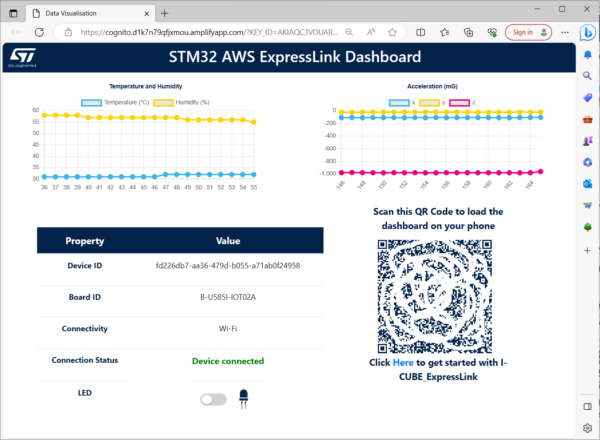
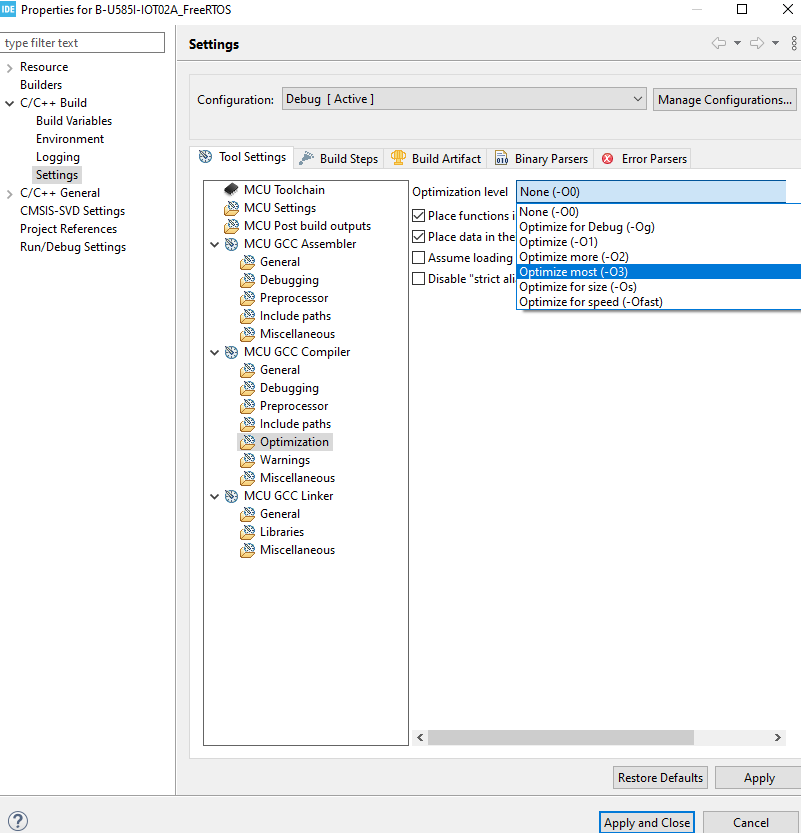

# I-CUBE-ExpressLink

## 1- Overview
* This is a CMSIS pack for [ExpressLink](https://aws.amazon.com/iot-expresslink/) driver for [STM32](https://www.st.com/en/microcontrollers-microprocessors/stm32-32-bit-arm-cortex-mcus.html) devices. It allows you to create applications to connect to AWS IoT core using [ExpressLink modules](https://devices.amazonaws.com/search?page=1&sv=iotxplnk) and to issue OTA (Over-The-Air) Updates.

   * AWS offers the possibility to deploy Host OTA firmware updates on selected devices from your fleet that were previously connected to AWS. A Host OTA is using the **ExpressLink Module** as an intermidiary to update the board it is connected to, the "**host**". This allows to optmize the host performance : a larger payload can be transmitted along with optimized memory ressources utilisation for the host, and the heavy authenticity checks effort is transfered to the Express Link Module.

   * This package includes scripts that allows you to issue Host OTA in a more easy and user friendly way. It reduces the number of steps that have to be done and doesn't require you to be familiar with the AWS console.

* The driver is compatible with [AWS IoT ExpressLink Technical Specification v1.1](https://aws.amazon.com/about-aws/whats-new/2022/11/aws-iot-expresslink-technical-specification-v1-1-released/).

* You **don't** need to clone the repo to use the driver and the examples. Just download the [CMSIS packs](https://github.com/stm32-hotspot/I-CUBE-ExpressLink#2--download-the-packs) and install them with [STM32CubeMX](https://www.st.com/stm32cubemx). 

* You will need to connect your board to a Wifi that is at least 2.4 GHz.

* Examples provided for the following boards:
    * [32F769IDISCOVERY](https://www.st.com/en/evaluation-tools/32f769idiscovery.html)
    * [B-L4S5I-IOT01A](https://www.st.com/en/evaluation-tools/b-l4s5i-iot01a.html)
    * [B-L475E-IOT01A](https://www.st.com/en/evaluation-tools/b-l475e-iot01a.html)
    * [B-U585I-IOT02A](https://www.st.com/en/evaluation-tools/b-u585i-iot02a.html)
    * [NUCLEO-C031C6](https://www.st.com/en/evaluation-tools/nucleo-c031c6.html)
    * [NUCLEO-F722ZE](https://www.st.com/en/evaluation-tools/nucleo-f722ze.html)
    * [NUCLEO-G0B1RE](https://www.st.com/en/evaluation-tools/nucleo-g0b1re.html)
    * [NUCLEO-G071RB](https://www.st.com/en/evaluation-tools/nucleo-g071rb.html)
    * [NUCLEO-H503RB](https://www.st.com/en/evaluation-tools/nucleo-h503rb.html)   
    * [NUCLEO-H755ZI](https://www.st.com/en/evaluation-tools/nucleo-h755zi-q.html)
    * [NUCLEO-U545RE-Q](https://www.st.com/en/evaluation-tools/nucleo-u545re-q.html)
    * [NUCLEO-U575ZI-Q](https://www.st.com/en/evaluation-tools/nucleo-u575zi-q.html)
    * [NUCLEO-WB55RG](https://www.st.com/en/evaluation-tools/nucleo-wb55rg.html)
    * [NUCLEO-WL55JC](https://www.st.com/en/evaluation-tools/nucleo-wl55jc.html)
    * [STM32L562E-DK](https://www.st.com/en/evaluation-tools/stm32l562e-dk.html)

* The HOTA updates can be issued with the following boards :
   * [B-U585I-IOT02A](https://www.st.com/en/evaluation-tools/b-u585i-iot02a.html)
   * [NUCLEO-G0B1RE](https://www.st.com/en/evaluation-tools/nucleo-g0b1re.html) 
   * [NUCLEO-U545RE-Q](https://www.st.com/en/evaluation-tools/nucleo-u545re-q.html)
   * [NUCLEO-U575ZI-Q](https://www.st.com/en/evaluation-tools/nucleo-u575zi-q.html)
   * [STM32L562E-DK](https://www.st.com/en/evaluation-tools/stm32l562e-dk.html)
   * [NUCLEO-H503RB](https://www.st.com/en/evaluation-tools/nucleo-h503rb.html)

* 56 projects for 15 boards and 12 STM32 uC series
* Projects generation with STM32CubeMX  no code/low code -> easy to port to any STM32 microcontrollers
* Baremetal and FreeRTOS projects
* Host OTA (HOTA), Shadow, PubSub, Sensor data, pass through
* HOTA support for STM32U5, STM32L5, STM32G0B and STM32H5
* Pass through project can be used to get thing name, get thing cert, set HOTA cert and update the module using otw
* Cellular support: FreeRTOS projects checks the module type (Wi-Fi or Cellular)
* FreeRTOS projects enable defender (10 mn period)
* Quick Connect script: 
   * Python
   * Support 10 boards
   * Auto board detection/programming
   * Issues detection/solution
   * Device registration
   * Device configuration
   * Open dashboard
* Serverless Dashboard: Plot sensor data and control LED using shadow messages
* ota-script a python script that makes OTA jobs easy and fast
* Arduino projects:
   * Compatible with Arduino IDE
   * Use Hardware Serial for ExpressLink.
   * Use library from https://github.com/awslabs/aws-iot-expresslink-library-arduino
* MicroPython project (STM32WB)

## 2- Advantage of I-CUBE-ExpressLink
* Very low code size
* Compatible with all STM32 product familly
* Zero code zero touch examples
* Multiple examples
* Very simple code
* STM32CubeMX code configuration and project generation

## 3- How to use
### 3.1- Download and install tools
* Download and Install [STM32CubeMX](https://www.st.com/stm32cubemx)
* Download and Install [STM32CubeIDE](https://www.st.com/stm32cubeide)
* Download and Install [Python](https://www.python.org/downloads/)
* Download and Install [AWS CLI](https://docs.aws.amazon.com/cli/latest/userguide/getting-started-install.html)

### 3.2- Download the packs
* Download [STMicroelectronics.I-CUBE-ExpressLink.0.5.0.pack](https://github.com/stm32-hotspot/I-CUBE-ExpressLink/raw/main/STMicroelectronics.I-CUBE-ExpressLink.0.5.0.pack)
* Download [STMicroelectronics.I-CUBE-STDIO.1.5.0.pack](https://github.com/stm32-hotspot/I-CUBE-STDIO/blob/main/Pack/STMicroelectronics.I-CUBE-STDIO.1.5.0.pack?raw=true)
* Download [AWS.coreJSON.4.0.0.pack](https://freertos-cmsis-packs.s3.us-west-2.amazonaws.com/AWS.coreJSON.4.0.0.pack)
* Download [ARM.CMSIS-FreeRTOS.10.4.6.pack](https://keilpack.azureedge.net/pack/ARM.CMSIS-FreeRTOS.10.4.6.pack)

### 3.3- Install the packs with STM32CubeMX
Install the **4** packs one by one as following. The order of installation doesn't matter.


Select one pack and proceed to its installation as following.


Then repeat for all the other packs.

### 3.4 Open the pack on your PC

Copy the following path :
```
%HOMEPATH%\STM32Cube\Repository\Packs\STMicroelectronics\I-CUBE-ExpressLink\0.5.0\Projects
```

Then paste it into the search bar and click enter to access the different projects :


Refer to the **README.md** for instructions on how to run the examples.

 

## 4- Examples List

* **FreeRTOS**: A project that uses the FreeRTOS. The project is compatible with the Quick Connect script.

* **HelloWorld**: Provides a very basic example.

* **MicroPython**: Example using [MicroPython](http://www.micropython.org/). Offered only for the [NUCLEO-WB55RG](https://www.st.com/en/evaluation-tools/nucleo-wb55rg.html) board. Refer to the project's [readme.md](./MicroPython/readme.md) on how to use it.

* **PassThrough**: Passthrough to use a terminal to communicate with the module. Can be used to get the ExpressLink ceritificate and the Thing name.

* **PubSub**: Example on how to publish and subscribe to a topic and receive MQTT messages.

* **Shadow**: Example on how to use the AWS Shadow messages.

* **QuickConnect**: Project + Binary + Python script to quickly connect the board to AWS. 

* **Arduino**: An [arduino](https://www.arduino.cc/) project. Tested with the [B-U585I-IOT02A](https://www.st.com/en/evaluation-tools/b-u585i-iot02a.html) board.

* **Scripts** : Contains the scripts that automate the processes of connecting the board to AWS and issuing Host Over The Air (HOTA) updates :
   * **STM32_AWS_ExpressLink_QuickConnect.py** : registers and connects your board to AWS, then opens a dashboard for you to see real time data from your board's sensors.
   * **generate_cert.ps1** : creates a certificate and register it on AWS. This certificate will be used to sign the firmware updates being uploaded on AWS for your HOTA.
   * **set_host_cert.ps1** : flashes the previous certificate into your board's memory. This allows to have the board verifiying any HOTA update being received from AWS before installing it.
   * **hota_update.ps1** : uploads the binairy of your firmware update on AWS and has AWS sending it to the board Over The Air. Then has the board verifies it, and if validated download flash and restart the host board with this new firmware.


_NOTES:_\
_- The driver is compatible with [AWS IoT ExpressLink Technical Specification v1.1](https://aws.amazon.com/about-aws/whats-new/2022/11/aws-iot-expresslink-technical-specification-v1-1-released/)._\


## 5- Set up your AWS account

### 5.1 - Create an AWS account
* Create an [AWS account](https://portal.aws.amazon.com/billing/signup)

### 5.2 - Create an IAM user
* Sign in to the [AWS _IAM_ Console](https://console.aws.amazon.com/iam/).
* On the left pane, under **Access Management** choose **Users** then click on **Add Users**
   <p align="center"></p>
* Choose a name for your IAM User
* Under **Permissions options**, select **Add user to group**
* Under **User groups**, check the box of the group **Administrators**, then click **Next**
   <p align="center"></p>
* Choose **Create user**

_NOTE : The examples in this document are intended only for dev environments. All devices in your fleet must have credentials with privileges that authorize only intended actions on specific resources. The specific permission policies can vary for your use case. Identify the permission policies that best meet your business and security requirements. For more information, see [Example IAM identity-based policies](https://docs.aws.amazon.com/IAM/latest/UserGuide/access_policies_examples.html) and [Security Best practices](https://docs.aws.amazon.com/IAM/latest/UserGuide/IAMBestPracticesAndUseCases.html) in the IAM Identity and Access Management User Guide.._

### 5.3 - Retreive your access keys
* Back on the **Users** menu, click on the **User** you just created.
* Choose **Security Credentials**, then under the section **Access keys** choose **Create access key**
* Select the option **Command Line Interface (CLI)** and check the **I understand** box at the bottom. Click **Next**
* Click **Create access key**
* A **public key "Access Key" and a private key "Secret Access Key"** has been created and assigned to your user.
  
_**WARNING** : It is **important that you store these keys** somewhere you can access them : you will need them for some AWS operation and **you won't be able to retrieve them once this windows will be closed**._

* You can either choose **Download .csv file** to downlaod a file containing both keys, or copy paste the two keys **Access key AND Secret access key** and paste them        somewhere.


### 5.4 - Create a profile
* Open a PowerShell console and paste the following command :
```
aws configure --profile default
```
* Successively paste the infos being asked : the **Access Key** and the **Private Access Key** previously generated, your **region** (ex : us-west-1) and then **json**.

<p align="center"></p>


## 6- Other Prerequisites

### 6.1- Update the ExpressLink module
Please refer to [Update the ExpressLink module](https://github.com/espressif/esp-aws-expresslink-eval#9-upgrading-expresslink-firmware) 

### 6.2- Install the ExpressLink module
Connect the ExpressLink module on your board's Arduino connector

### 6.3- Install the python libraries

* Copy the following path, then paste it into the windows search bar and click enter.
```
%HOMEPATH%\STM32Cube\Repository\Packs\STMicroelectronics\I-CUBE-ExpressLink\0.5.0\Projects\scripts
```
* From this folder open a Command Prompt and paste the following command :
```
pip install -r requirements_windows.txt
```

## 7- Connect your board to AWS

* Copy the following path, then paste it into the windows search bar and click enter.
```
%HOMEPATH%\STM32Cube\Repository\Packs\STMicroelectronics\I-CUBE-ExpressLink\0.5.0\Projects\scripts\QuickConnect
```
* From this folder, open a Command Prompt and paste the following command to run the script that will register and connect your board into AWS :
```
python .\STM32_AWS_ExpressLink_QuickConnect.py -i
```
<p align="center"></p>

* Enter your SSID and Password.

<p align="center"></p>

* Then a web browser window will open with the dashboard. You can then see the sensors data in real time, toggle the blue LED of your board and scan the QR code with your phone to open the same dashboard on your phone and control the LED with it as well.

<p align="center"></p>

* You can see the **name of your board on AWS "device ID"**. If you later want to issue a Host Over The Air Update you will need this name so you can save it somewhere.


## 8- Create a FW update of the FreeRTOS project

* Copy the following path, then paste it into the search bar and click enter.
```
%HOMEPATH%\STM32Cube\Repository\Packs\STMicroelectronics\I-CUBE-ExpressLink\0.5.0\Projects\FreeRTOS
```
* Select your board folder and double click on **Your_Board-Name_FreeRTOS.ioc** to open it with STM32CubeMX.

* In STM32CubeMX
   * Click **Generate Code**
   * Click **Open Project**
   * The project should open in STM32CubeIDE
   * Choose any workspace folder or create one in the folder **Windows(C:)/ST** then **Launch**

 <p align="center"></p>
   
* Proceed with the FW changes for your new update, and update the app version in the file **Inc\application_version.h** :
   
   
* For STM32CubeIDE setup :
   * Enable **bin files** post build output : right click on the FreeRTOS project, choose properties, C/C++ Builds, Settings, MCU Post build outputs and check the **Convert to binary file (-O binary)** box, then **Apply and Close**.
   * **For NUCLEO-H503RB users only** : for code size compatibility purposes, you also need to enable the optimization level to -O3 or -Os. To do so, right click on the FreeRTOS project, choose properties, C/C++ Builds, Settings, MCU GCC Compiler, Optimization, and set Optmization level to **Optimize Most (-O3)** or **Optimize for size (-Os)**, then **Apply and Close**.



* Save your project and build it :

<p align="center"></p>

## 9- Create your HOTA certificate and upload it into AWS and the board

_NOTE : This section is mandatory just the first time you are doing an HOTA, as you will need to create a signing profile associated with a signing certificate. Once you have a signing profile created, and the board memory contains the associated signing certificate, you can use it for your following HOTAs : if doing so, you can jump to section **10** directly._

### 9.1- Create the HOTA signing certificate

This 2nd script creates a certificate and uploads it into AWS. It will later on be associated with an AWS **Signing profile**, which will allow to sign the firmware update binairies being send to AWS for HOTAs.
The generated **certificate**, its associated **private key**, and its **ARN** - a identifier issued by AWS upon the certificate registration - will be saved in the same folder of the script as following : 

**ecdsasigner.pem** \
**ecdsasigner-priv-key.pem** \
**CERT_ARN.txt**


* Paste the following on your Windows Search Bar to access the folder containing the script :
```
%HOMEPATH%\STM32Cube\Repository\Packs\STMicroelectronics\I-CUBE-ExpressLink\0.5.0\Projects\scripts\host-ota-cert
```
* The default settings of your certificate will be as following. You can edit them by opening the script file **generate_cert.ps1** with any text editor. Note that **Common Name** must not be empty, but appart from that the content you are choosing won't affect the rest of the steps.
  * AWS CLI Profile : default
  * Country : France
  * State : Paris
  * Locality : Paris
  * Organization : STMicroelectronics
  * Common Name : stm32h501

* Still from this same host-ota-cert folder, open a Comand Prompt Terminal and paste the following command to **run the script** that will **generate the HOTA signing certificate and upload it on AWS** :

```
.\generate_cert.ps1
```

<p align="center"></p>

* You can check that your certificate was uploaded by going into the [AWS ACM Console](https://us-west-1.console.aws.amazon.com/acm/home?region=us-west-1#/certificates/list) and compare the ARN.

<p align="center"></p>


### 9.2 Upload the HOTA certificate into the board

This 3rd script uploads the previously generated HOTA certificate into the board. This will allow the board to check the signature of new HOTA updates being received from AWS before installing them.

* If you have any serial emulator openned (Tera Term, Putty, brower serial emulator...) close it or disconnect.

* Still from this same host-ota-cert folder, open a Comand Prompt Terminal and paste the following command to **run the script** that will **uplaod the HOTA signing certificate into the board** :

```
.\set_hota_cert.ps1
```

<p align="center"></p>

* Press the **Reset button** of your board when asked to reset the board.


## 10- Issue the Host OTA

We are now going to use the 4th scripts to issue the Host OTA.

* To access the script folder, copy the following path, then paste it into the search bar and click enter.
```
%HOMEPATH%\STM32Cube\Repository\Packs\STMicroelectronics\I-CUBE-ExpressLink\0.5.0\Projects\host-ota
```
* Open the script file **hota_update.ps1** with a text editor.
* Fill the different arguments of the script :
   * Make sure the **name of the board you are using** is the only one **uncommented**
   * For **AWS CLI profile name** , put **"default"** (or another name if you used a different one in **step 5.4**)
   * Enter your **THING_NAME** that was printed in the AWS dashboard in step **7**
   * For **ROLE**, **OTA_SIGNING_PROFILE**, and **S3BUCKET** : if you already have some of these created, you can put their names to use them. Else choose a new name and the script will create it automatically.
   * For **CERT_ARN** :\
         - Copy and paste the folling path into your search window :\
         ```
         %HOMEPATH%\STM32Cube\Repository\Packs\STMicroelectronics\I-CUBE-ExpressLink\0.5.0\Projects\scripts\host-ota-cert
         ```
         \
         - Copy the content of the file **CERT_ARN.txt**. It should have the following format :\
           _arn:aws:acm:YourLocation:.......:certificate/........_ \
         - Paste it into the **hota_update** script you were filling.
   * Save your document.

 <p align="center"></p>

_NOTE :_\
_- If you create a new signing profile, it will be associated with the certificate of the ARN that was provided as one of the parameters._\
_- For your HOTA to be accepted, you must use the signing profile associated with the same HOTA certificate that is in your board memory._

   
* Still from the hota-script folder, open a Comand Prompt Terminal and paste the following command to run the script that will issue your HOTA :

```
.\hota_update.ps1
```

<p align="center"></p>

* Your script should issue your HOTA. You can take note of the name of the HOTA, it will have the format **ExpressLink-X** with X being numbers


## 11- Check HOTA update success

### 11.1 Check through AWS

You can monitor the status of the HOTA being issued using the AWS console. To do so go to the the [AWS IoT Console](http://console.aws.amazon.com/iot), then in the Manage section on the left pane, select Remote Actions, Jobs and select your HOTA (you can use the its name or the created date if you are note sure which one it is).

<p align="center"></p>

On the section Detail, you have your HOTA infos and its current status :

<p align="center"></p>

On the section Job execution, you can see you HOTA execution status :

<p align="center"></p>

Here we can see that the HOTA was successful.

_NOTE : An HOTA that was send to the host but not implemented will be marked as "Complete" on the main and Job Detail page but "failed" on the Job execution one. It is recommended to check the Job execution page to ensure the HOTA was successsful._

### 11.2 Check through a serial emulator

* If your board is connected to your PC, open this [online serial emulator](https://googlechromelabs.github.io/serial-terminal/)
   * Click "Connect", select the ST-Link COM port, and click "Connect"
   * Choose the following settings : 
   * Baud rate : 115200
   * Data bits : 8-bits
   * parity : None
   * Check Local Echo box 

You should then see the different steps of : the HOTA being detected, verified by checking its signature, downloaded into the other Bank of the board, then the boards switching to this other bank and restaring from from this new one. Please note that some steps might take some time before printing outputs.

By checking the printed version number after this restart you can ensure that the HOTA was successful.

<p align="center"></p>
