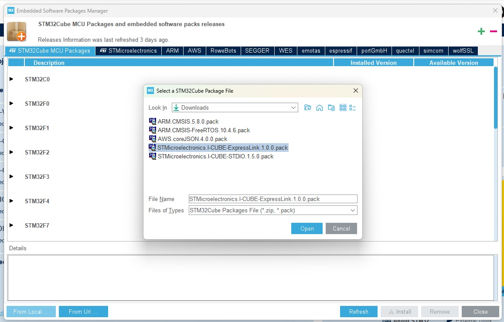
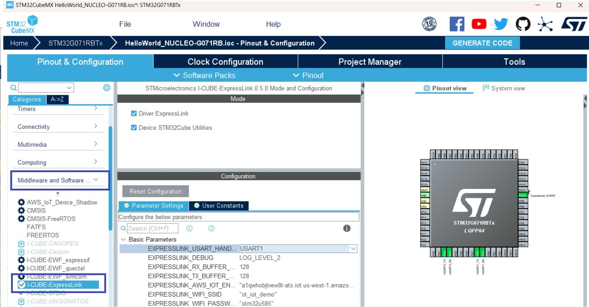
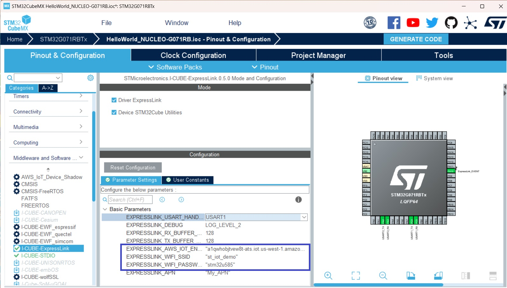
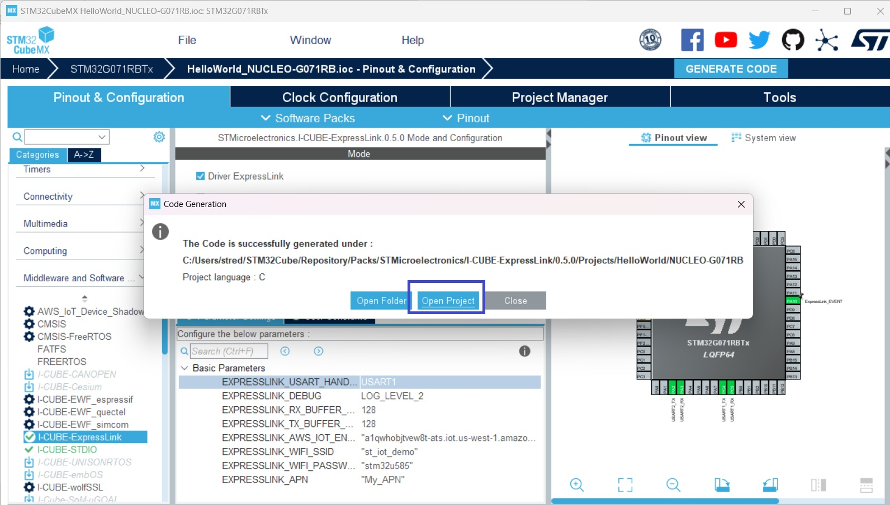
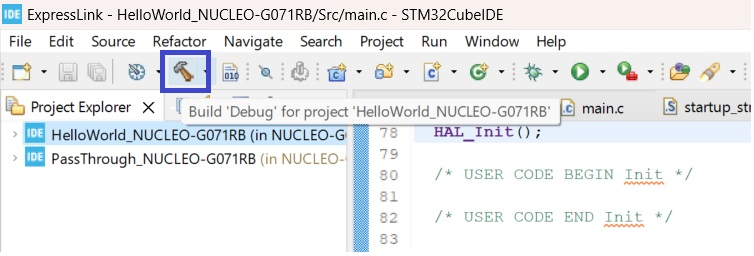

# I-CUBE-ExpressLink

## Overview:
* This is a CMSIS pack for [ExpressLink](https://aws.amazon.com/iot-expresslink/) driver for [STM32](https://www.st.com/en/microcontrollers-microprocessors/stm32-32-bit-arm-cortex-mcus.html) device. It allows you to create applications to connect to AWS IoT core using [ExpressLink modules](https://devices.amazonaws.com/search?page=1&sv=iotxplnk).

* The pack contains a driver for ExpressLink modules and a set of **30** examples. 

    * **HelloWorld**: Provides a very basic example
    * **PubSub**: Example on how to publish and subscribe to a topic and receive MQTT messages
    * **Shadow**: Example on how to use the AWS Shadow messages
    * **FreeRTOS**: A project that use the FreeRTOS and Shadow services. The example is offered only for the [32F769IDISCOVERY](https://www.st.com/en/evaluation-tools/32f769idiscovery.html) and [NUCLEO-WB55RG](https://www.st.com/en/evaluation-tools/nucleo-wb55rg.html) bords
    * **PassThrough**: Passthrough to use a terminal to communicate with the module. Can be used to get the ExpressLink ceritificate and the Thing name
    * **SensorData**: Send humidity and temperature from the HTS221 sensor present on the  [B-U585I-IOT02A](https://www.st.com/en/evaluation-tools/b-u585i-iot02a.html) board
    * **MicroPython** Example using [MicroPython](http://www.micropython.org/). Offered only for the [NUCLEO-WB55RG](https://www.st.com/en/evaluation-tools/nucleo-wb55rg.html) board. Refer to the project's [readme.md](https://github.com/stm32-hotspot/I-CUBE-ExpressLink/blob/main/Projects/MicroPython/readme.md) on how to use it
    * **QuickConnect** Project + Binary + Python script to quickly connect the board to AWS. Offed for [B-U585I-IOT02A](https://www.st.com/en/evaluation-tools/b-u585i-iot02a.html) and [NUCLEO-G071RB](https://www.st.com/en/evaluation-tools/nucleo-h755zi-q.html).
    * **arduino** an [arduino](https://www.arduino.cc/) project. Tested with the [B-U585I-IOT02A](https://www.st.com/en/evaluation-tools/b-u585i-iot02a.html) board.
* You **don't** need to clone the repo to use the driver and the examples. Just download the [CMSIS packs](https://github.com/stm32-hotspot/I-CUBE-ExpressLink#2--download-the-packs) and install them with [STM32CubeMX](https://www.st.com/stm32cubemx). 

* The [STMicroelectronics.I-CUBE-ExpressLink.0.2.0.pack](https://github.com/stm32-hotspot/I-CUBE-ExpressLink/raw/main/I-CUBE-ExpressLink/STMicroelectronics.I-CUBE-ExpressLink.0.2.0.pack) pack comes the driver and the examples. Some examples depend on other CMSIS packs. The [list of the packs and links](https://github.com/stm32-hotspot/I-CUBE-ExpressLink#2--download-the-packs) is provided below.

* The examples do not inlude the IDE project. Only the [STM32CubeMX](https://www.st.com/stm32cubemx) **.ioc** file is provided. The **main.c** file is provided for some projects.  [STM32CubeMX](https://www.st.com/stm32cubemx) will import all the necessary files for the project to build and run properly.

* To run an example, 
 
    1- Open the **example's .ioc** file with [STM32CubeMX](https://www.st.com/stm32cubemx)
    
    2-  Set the AWS endpoint, Wi-Fi SSID and password
    
    3- Generate the project for your preferrd IDE. 

    4- Open the generated project with your selected IDE

    5- Build the project 

    6- Download to your target board

* [STM32CubeIDE](https://www.st.com/stm32cubeide) is set by default for all the examples. 

* You should be able to use the [IAR 32Kbyte code size limited version](https://www.iar.com/products/architectures/arm/iar-embedded-workbench-for-arm/iar-embedded-workbench-for-arm---free-trial-version/) as most of the project should be less than 32K of code

* You need to [register your ExpressLink module](https://github.com/espressif/esp-aws-expresslink-eval#6-registering-expresslink-to-your-development-account)  to your AWS account before running the project.

* You can use the ***%HOMEPATH%\STM32Cube\Repository\Packs\STMicroelectronics\I-CUBE-ExpressLink\0.2.0\Projects\PassThrough*** to get the certificate and device name. Use **AT+CONF? Certificate pem** and **AT+CONF? ThingName**

* Examples provided for the following boards:
    * [32F769IDISCOVERY](https://www.st.com/en/evaluation-tools/32f769idiscovery.html)
    * [B-L4S5I-IOT01A](https://www.st.com/en/evaluation-tools/b-l4s5i-iot01a.html)
    * [B-U585I-IOT02A](https://www.st.com/en/evaluation-tools/b-u585i-iot02a.html)
    * [NUCLEO-C031C6](https://www.st.com/en/evaluation-tools/nucleo-c031c6.html)
    * [NUCLEO-F722ZE](https://www.st.com/en/evaluation-tools/nucleo-f722ze.html)
    * [NUCLEO-G071RB](https://www.st.com/en/evaluation-tools/nucleo-g071rb.html)
    * [NUCLEO-H755ZI](https://www.st.com/en/evaluation-tools/nucleo-h755zi-q.html)
    * [NUCLEO-WB55RG](https://www.st.com/en/evaluation-tools/nucleo-wb55rg.html)
    * [NUCLEO-WL55JC](https://www.st.com/en/evaluation-tools/nucleo-wl55jc.html)

* The examples can be easily ported to any other STM32 based board
* Check the [**Known Issues**](https://github.com/stm32-hotspot/I-CUBE-ExpressLink#known-issues) section.

* [ExpressLink Firmware v2.4.1](https://github.com/espressif/esp-aws-expresslink-eval/releases/tag/v2.4.1) was used for testing

* You might need to [update the ExpressLink module](https://github.com/espressif/esp-aws-expresslink-eval#9-upgrading-expresslink-firmware) before using it. 

* The pack and examples were tested on Windows machines only.

* The pack and examples were tested with IAR and STM32CubeIDE.

## 1- Download and install tools
* Doownload and Install [STM32CubeMX](https://www.st.com/stm32cubemx)
* Doownload and Install [STM32CubeIDE](https://www.st.com/stm32cubeide)

## 2- Download the packs
* Download [STMicroelectronics.I-CUBE-ExpressLink.0.2.0.pack](https://github.com/stm32-hotspot/I-CUBE-ExpressLink/raw/main/I-CUBE-ExpressLink/STMicroelectronics.I-CUBE-ExpressLink.0.2.0.pack)
* Download [STMicroelectronics.I-CUBE-STDIO.1.5.0.pack](https://github.com/stm32-hotspot/I-CUBE-STDIO/blob/main/Pack/STMicroelectronics.I-CUBE-STDIO.1.5.0.pack?raw=true)
* Download [AWS.coreJSON.4.0.0.pack](https://freertos-cmsis-packs.s3.us-west-2.amazonaws.com/AWS.coreJSON.4.0.0.pack)

## 3- Install the packs with STM32CubeMX

Install the **3** packs one by one as following. The order of installation doesn't matter

## 4- Open and configure a project

Navigate to: ***%HOMEPATH%\STM32Cube\Repository\Packs\STMicroelectronics\I-CUBE-ExpressLink\0.1.0\Projects\HelloWorld\NUCLEO-G071RB***

Double click on **HelloWorld_NUCLEO-G071RB.ioc** to open it with STM32CubeMX

* Select Software Packs

* Select the I-CUBE-ExpressLink

* Set your AWS IoT Endpoint, Your Wi-Fi SSID and Wi-Fi password

* Generate your project

* Open the project

* Build the project and flash the binary to the device

* Open a terminal application and select ST-Link com port

* Configure the serial terminal (115200, 8 bits, 1 stop)

* Setup the serial terminal

* Terminal Output

## Known issues:
* The **PassThrough** project **can not** be used to update the module. You need to use a FTDI module for example
* **LOG_LEVEL_2** can not be used with **PubSub** project

