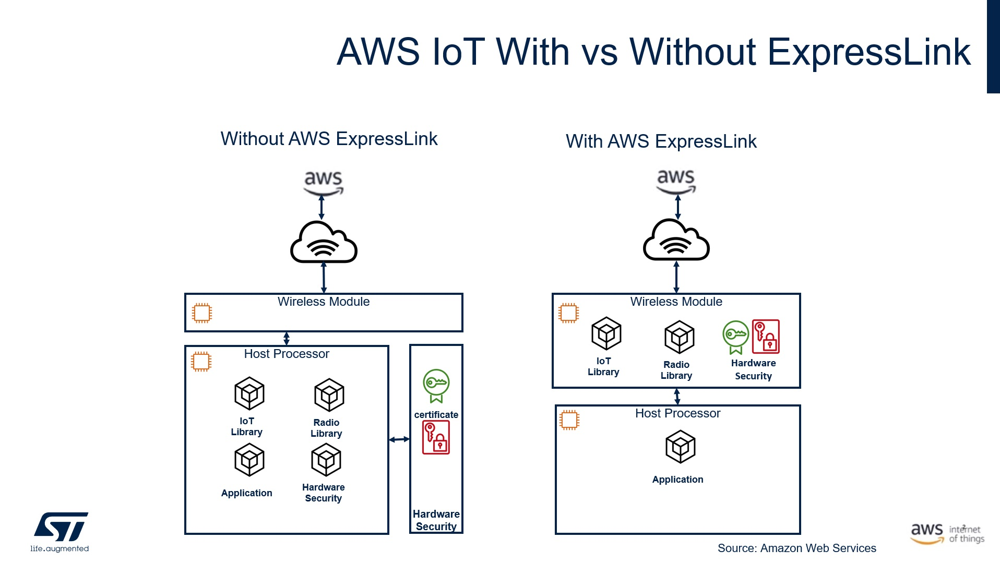

# I-CUBE-ExpressLink

# Overview:
* This is a CMSIS pack for [ExpressLink](https://aws.amazon.com/iot-expresslink/) driver for [STM32](https://www.st.com/en/microcontrollers-microprocessors/stm32-32-bit-arm-cortex-mcus.html) devices. It allows you to create applications to connect to AWS IoT core using [ExpressLink modules](https://devices.amazonaws.com/search?page=1&sv=iotxplnk).

* The driver is compatible with [AWS IoT ExpressLink Technical Specification v1.1](https://aws.amazon.com/about-aws/whats-new/2022/11/aws-iot-expresslink-technical-specification-v1-1-released/)

* You **don't** need to clone the repo to use the driver and the examples. Just download the [CMSIS packs](https://github.com/stm32-hotspot/I-CUBE-ExpressLink#2--download-the-packs) and install them with [STM32CubeMX](https://www.st.com/stm32cubemx). 

* Examples provided for the following boards:
    * [32F769IDISCOVERY](https://www.st.com/en/evaluation-tools/32f769idiscovery.html)
    * [B-L4S5I-IOT01A](https://www.st.com/en/evaluation-tools/b-l4s5i-iot01a.html)
    * [B-U585I-IOT02A](https://www.st.com/en/evaluation-tools/b-u585i-iot02a.html)
    * [NUCLEO-C031C6](https://www.st.com/en/evaluation-tools/nucleo-c031c6.html)
    * [NUCLEO-F722ZE](https://www.st.com/en/evaluation-tools/nucleo-f722ze.html)
    * [NUCLEO-G071RB](https://www.st.com/en/evaluation-tools/nucleo-g071rb.html)
    * [NUCLEO-H755ZI](https://www.st.com/en/evaluation-tools/nucleo-h755zi-q.html)
    * [NUCLEO-WB55RG](https://www.st.com/en/evaluation-tools/nucleo-wb55rg.html)
    * [NUCLEO-WL55JC](https://www.st.com/en/evaluation-tools/nucleo-wl55jc.html)

* The examples can be easily ported to any other STM32 based board

# Advantage
* Very low code size
* Compatible with all STM32 product familly
* Zero code zero touch examples
* Multiple examples
* Very simple code
* STM32CubeMX code configuration and project generation


# How to use
## 1- Download and install tools
* Doownload and Install [STM32CubeMX](https://www.st.com/stm32cubemx)
* Doownload and Install [STM32CubeIDE](https://www.st.com/stm32cubeide)
* Doownload and Install [Tera Term](https://osdn.net/projects/ttssh2/downloads/74780/teraterm-4.106.exe/) (optional)

## 2- Download the packs
* Download [STMicroelectronics.I-CUBE-ExpressLink.0.3.0.pack](https://github.com/stm32-hotspot/I-CUBE-ExpressLink/raw/main/STMicroelectronics.I-CUBE-ExpressLink.0.3.0.pack)
* Download [STMicroelectronics.I-CUBE-STDIO.1.5.0.pack](https://github.com/stm32-hotspot/I-CUBE-STDIO/blob/main/Pack/STMicroelectronics.I-CUBE-STDIO.1.5.0.pack?raw=true)
* Download [AWS.coreJSON.4.0.0.pack](https://freertos-cmsis-packs.s3.us-west-2.amazonaws.com/AWS.coreJSON.4.0.0.pack)

## 3- Install the packs with STM32CubeMX
Install the **3** packs one by one as following. The order of installation doesn't matter


## 4 Open the pack on your PC
Copy the following path
```
C:\Users\%USERNAME%\STM32Cube\Repository\Packs\STMicroelectronics\I-CUBE-ExpressLink\0.3.0\Projects
```

paste the link to the search 


Refere to the **README.md** for instructions on how to run the examples

 


